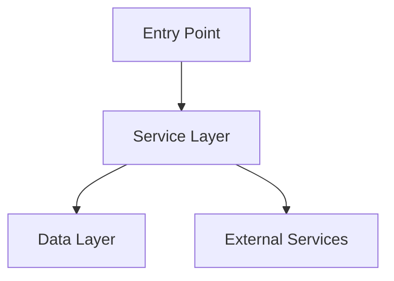

## Architecture Notes

This document describes the system architecture, design patterns, and key technical decisions.

For complete symbol counts and dependency analysis, see [`codebase-map.json`](./codebase-map.json).

## System Architecture Overview

**Architecture Style**: [Monolith / Modular Monolith / Microservices]

**Key Components**:
- **Entry Layer**: Handles incoming requests (CLI, HTTP, etc.)
- **Service Layer**: Core business logic and orchestration
- **Data Layer**: Persistence and external service integration

**Request Flow**:
1. Request enters through entry point
2. Routed to appropriate service handler
3. Service processes and returns response

## Architectural Layers

- **Entry Points**: Application entry and initialization (`src/`)
- **Services**: Core business logic (`src/services/`)
- **Models/Types**: Data structures and type definitions (`src/types/`)
- **Utilities**: Shared helper functions (`src/utils/`)

> See [`codebase-map.json`](./codebase-map.json) for complete symbol counts and dependency graphs.

## Detected Design Patterns

| Pattern | Locations | Description |
|---------|-----------|-------------|
| [Pattern Name] | `src/path/` | [Brief description] |

*Update this table as patterns are identified in the codebase.*

## Entry Points

- [`src/index.ts`](../src/index.ts) — Main module entry
- [`src/cli.ts`](../src/cli.ts) — CLI entry point (if applicable)

## Public API

| Symbol | Type | Location |
|--------|------|----------|
| [ExportName] | class/function/type | `src/path.ts` |

See [`codebase-map.json`](./codebase-map.json) for the complete public API listing.

## Internal System Boundaries

<!-- Document seams between domains, bounded contexts, or service ownership. Note data ownership, synchronization strategies, and shared contract enforcement. -->

_Add descriptive content here (optional)._

## External Service Dependencies

<!-- List SaaS platforms, third-party APIs, or infrastructure services. Describe authentication methods, rate limits, and failure considerations. -->

- _Item 1 (optional)_
- _Item 2_
- _Item 3_

## Key Decisions & Trade-offs

Document key architectural decisions here. Consider creating Architecture Decision Records (ADRs) for significant choices.

**Template**:
- **Decision**: [What was decided]
- **Context**: [Why this decision was needed]
- **Alternatives**: [What else was considered]
- **Consequences**: [Impact of this decision]

## Diagrams

*Replace with actual system architecture diagram.*

## Risks & Constraints

<!-- Document performance constraints, scaling considerations, or external system assumptions. -->

_Add descriptive content here (optional)._

## Top Directories Snapshot

- `src/` — Source code
- `tests/` — Test files
- `docs/` — Documentation

*See [`codebase-map.json`](./codebase-map.json) for detailed file counts.*

## Related Resources

- [Project Overview](./project-overview.md)
- [Data Flow](./data-flow.md) (if applicable)
- [Codebase Map](./codebase-map.json)

## Related Resources

<!-- Link to related documents for cross-navigation. -->

- [project-overview.md](./project-overview.md)
- [data-flow.md](./data-flow.md)
- [codebase-map.json](./codebase-map.json)
