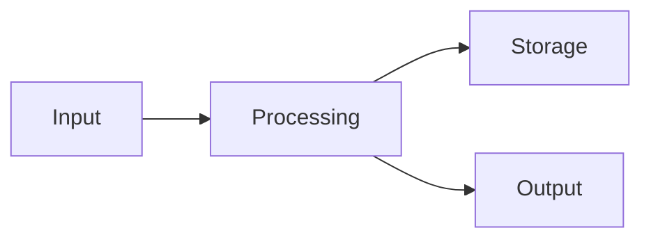

## Data Flow & Integrations

This document describes how data flows through the system, including internal processing and external integrations.

Understanding data flow helps with debugging, performance optimization, and maintaining system reliability.

## Module Dependencies

Module dependency overview:

- **Entry Layer** → Services, Utils
- **Services** → Data Access, External APIs
- **Data Access** → Database, Cache

*See [`codebase-map.json`](./codebase-map.json) for detailed dependency graphs.*

## Service Layer

Key services in the system:

- **[ServiceName]** — [Purpose] (`src/services/path.ts`)

*See [`codebase-map.json`](./codebase-map.json) for complete service listings.*

## High-level Flow

**Data Flow Steps**:
1. Data enters through entry points (API, CLI, etc.)
2. Services process and transform data
3. Results are stored and/or returned to caller

*Replace with actual system data flow.*

## Internal Movement

<!-- Describe how modules collaborate (queues, events, RPC calls, shared databases). -->

_Add descriptive content here (optional)._

## External Integrations

**External Services**:

| Service | Purpose | Auth Method |
|---------|---------|-------------|
| [Service] | [Purpose] | [API Key/OAuth/etc.] |

*Document error handling and retry strategies for each integration.*

## Observability & Failure Modes

<!-- Describe metrics, traces, or logs that monitor the flow. Note backoff, dead-letter, or compensating actions. -->

_Add descriptive content here (optional)._

## Related Resources

<!-- Link to related documents for cross-navigation. -->

- [architecture.md](./architecture.md)
