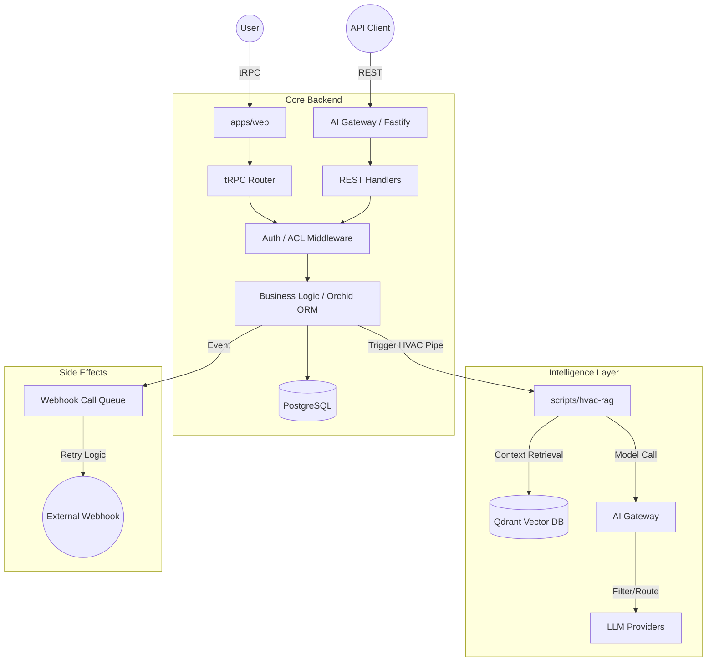

# Data Flow & Integrations

This document describes the architectural patterns, data movement, and service integrations within the monorepo. The system follows a distributed architecture where data flows through three primary channels: internal **tRPC** communication, a secured **REST API Gateway**, and an **Asynchronous Orchestration Engine** for AI workflows.

## Core Data Architecture

The system follows a multi-tenant architecture where data isolation is enforced at the persistence layer. Data enters via the React frontend (`apps/web`) or external API consumers into the central API service (`apps/api`), which manages state using **Orchid ORM** and **PostgreSQL**.

### High-Level Component Relationship

*   **apps/web**: React UI using `@trpc/client` for type-safe communication and `packages/zod-schemas` for client-side validation.
*   **apps/api**: The core backend and persistence layer. It manages the PostgreSQL schema mapping via `Table` classes (e.g., `UsersTable`, `ServiceOrderTable`) and exports the `AppTrpcRouter`.
*   **scripts/hvac-rag**: The "Intelligence" layer. Handles complex HVAC-specific RAG (Retrieval-Augmented Generation), "skills" execution, and vector database interactions via Qdrant.
*   **apps/ai-gateway**: A high-performance proxy for AI workloads (STT/TTS/Chat), implementing specialized filters like the `ptbr-filter.ts` (Portuguese language optimization).
*   **packages/zod-schemas**: The "Single Source of Truth." Every request, response, and database entity is defined here to ensure end-to-end type safety across TypeScript and Python services.

---

## The Request Pipeline

The system implements a **"Request-Validate-Execute-Notify"** pattern for all data modifications.

### 1. Ingress & Middleware
Requests hitting `apps/api` or `apps/ai-gateway` pass through a tiered security stack:
*   **Web Authentication**: `sessionSecurity.middleware.ts` validates cookie-based sessions and checks `SessionSecurityLevel`.
*   **Internal Security**: `validateApiSecret` (in `hvac.routes.ts`) allows trusted components like Open WebUI to bypass typical session requirements for specific HVAC pipelines.
*   **Rate Limiting**: Implementation of sliding window limiters (e.g., `SlidingWindowLimiter` in Python) and Fastify plugins prevent API abuse.

### 2. Validation & Usage Tracking
*   **Schema Validation**: Input is parsed against Zod types (e.g., `ServiceOrderCreateInput` from `packages/zod-schemas`).
*   **Tracing**: Request metadata like IP address and device fingerprints are extracted using `request-metadata.utils.ts`.

### 3. Execution & State Transition
*   **Synchronous Path**: Direct CRUD operations on tables like `ClientsTable`, `ContractsTable`, or `LeadsTable` via Orchid ORM in the API modules.
*   **Intelligence Path**: HVAC queries are routed via `hvac.client.ts` to specialized RAG pipes that build context packs, resolve technical evidence, and query Qdrant.

### 4. Egress & Side Effects
*   **Response**: The original caller receives processed data or a job status.
*   **Webhooks**: Long-running or external notifications are managed via `WebhookCallQueueTable` and `WebhookDeliveriesTable` to ensure reliable delivery with retry logic.

---

## Data Flow Diagram

---

## Integration Specifics

### Identity & Access (Auth)
*   **Google OAuth2**: Handled in `apps/api/src/modules/auth/oauth2`. It manages the exchange of codes for user profiles, syncing with the `UserTable`.
*   **Session Management**: `DatabaseSessionStore` persists sessions in the `SessionTable`, enabling global session invalidation and cross-service security checks.

### HVAC RAG & AI Pipeline
*   **Vector Sync**: Technical data is prepared via `hvac_formatter.py` and indexed into Qdrant using `hvac_index_qdrant.py`.
*   **Resolution Engine**: `hvac_resolver.py` calculates `EvidenceLevel` and `CoverageMap` to ensure LLM responses are grounded in actual technical documentation.
*   **Audio Pipeline**: `apps/ai-gateway` routes transcription to Groq/Whisper and speech synthesis to TTS bridges, applying the `ptbr-filter` for better Portuguese phonetics and accuracy.

---

## Core Schema References

| Data Domain | Table Class | Zod Schema (Selection) |
| :--- | :--- | :--- |
| **Auth** | `UserTable`, `SessionTable` | `UserSelectAll`, `SessionMetadata` |
| **CRM** | `ClientsTable`, `AddressesTable` | `ClientCreateInput`, `AddressType` |
| **Project** | `KanbanBoardsTable`, `KanbanCardsTable` | `BoardCreateInput`, `CardUpdateInput` |
| **Maintenance** | `ServiceOrderTable`, `EquipmentTable` | `ServiceOrderCreateInput`, `TechnicalReportSelectAll` |
| **System** | `SubscriptionsTable`, `ApiProductRequestLogTable` | `SubscriptionSelectAll`, `ApiProductRequestLogCreateInput` |

---
**See Also:**
*   `packages/zod-schemas/README.md` for detailed field definitions and validation logic.
*   `apps/api/src/routers/trpc.router.ts` for the full list of available web procedures.
*   `scripts/hvac-rag/README.md` for the internal logic of the RAG resolution engine.
