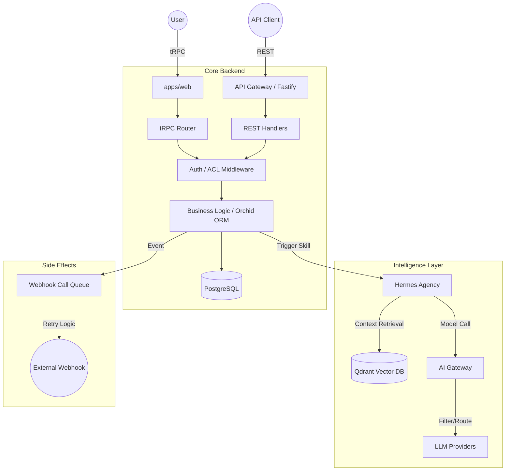

# Data Flow & Integrations

This document outlines the architectural patterns, data movement, and service integrations within the monorepo. The system is built as a distributed architecture where data flows through three primary channels: internal **tRPC** communication, a secured **REST API Gateway**, and an **Asynchronous Orchestration Engine** for AI workflows.

## Core Data Architecture

The system follows a multi-tenant architecture where data isolation is enforced at the persistence layer. Data enters the system via the React frontend (`apps/web`) or external API consumers, flowing into the central API service (`apps/api`) which manages state using **Orchid ORM** and **PostgreSQL**.

### High-Level Component Relationship

*   **apps/web**: The primary user interface. It uses `@trpc/client` for type-safe communication and `packages/zod-schemas` for client-side form validation.
*   **apps/api**: The core backend and persistence layer. It manages the PostgreSQL schema mapping via `Table` classes (e.g., `UsersTable`, `SubscriptionsTable`) and exports the `AppTrpcRouter`.
*   **apps/hermes-agency**: The "Intelligence" layer. It handles complex LLM orchestration, "skills" execution, and vector database interactions.
*   **apps/ai-gateway**: A high-performance proxy specifically for AI workloads (STT/TTS/Chat), implementing specialized filters like the `ptbr-filter.ts`.
*   **packages/zod-schemas**: The "Single Source of Truth" for data structures. Every request, response, and database entity is defined here to ensure end-to-end type safety.

---

## The Request Pipeline

The system implements a standard **"Request-Validate-Execute-Notify"** pattern for all data modifications.

### 1. Ingress & Middleware
When a request hits `apps/api` or `apps/ai-gateway`, it passes through a tiered security stack:
*   **Web Authentication**: `sessionSecurity.middleware.ts` validates cookie-based sessions and checks `SessionSecurityLevel`.
*   **API Authentication**: `apiKeyAuth.middleware.ts` validates external `x-api-key` headers against the `SubscriptionsTable`.
*   **Rate Limiting**: `checkRateLimit` (in `apps/hermes-agency`) and internal Fastify plugins prevent abuse.

### 2. Validation & Usage Tracking
*   **Schema Validation**: Input is parsed against Zod types (e.g., `ServiceOrderCreateInput`).
*   **Quota Check**: For AI-related requests, `subscriptionTracker.utils.ts` verifies if the team has remaining credits. If usage hits 90%, `checkAndQueueWebhookAt90Percent` triggers an automated notification.

### 3. Execution & State Transition
*   **Synchronous Path**: Direct CRUD operations on tables like `ClientsTable`, `ContractsTable`, or `LeadsTable` via Orchid ORM.
*   **Asynchronous Path**: Complex tasks (like generating a social calendar) are handed off to the **Agency Router**.

### 4. Egress & Side Effects
*   **Response**: The original caller receives the processed data or a job ID.
*   **Events**: Side effects are recorded in the `EventoTable`. If a webhook is registered for that event, a delivery task is added to `WebhookCallQueueTable`.

---

## Data Flow Diagram

---

## Integration Specifics

### Identity & Access (Auth)
*   **Google OAuth2**: Implemented in `apps/api/src/modules/auth/oauth2`. It manages the exchange of authorization codes for user profiles, creating or updating records in the `UserTable`.
*   **Session Management**: `DatabaseSessionStore` persists sessions in the `SessionTable`, allowing for features like "Force Logout from all devices."

### AI & LLM Ecosystem
*   **Embedding Data**: `apps/hermes-agency/src/qdrant/client.ts` manages the synchronization of relational data into vector space for RAG (Retrieval-Augmented Generation).
*   **Skill System**: The `agency_router.ts` maps user intents to specific Python or TypeScript "Skills" (e.g., `executeSocialCalendar`).
*   **Audio Pipeline**: `apps/ai-gateway` routes transcription requests to `whisper-server-v2.py` and speech synthesis to TTS bridges.

### Reliability & Observability
*   **API Logging**: Every external request is logged in `ApiProductRequestLogsTable` via `requestLogger.middleware.ts`. This includes status, duration, and original request metadata.
*   **Webhook Resilience**: Outbound notifications use an exponential backoff strategy (up to 3 retries). Failures and successes are tracked in `WebhookDeliveriesTable`.
*   **Distributed Locking**: `distributed_lock.ts` uses Redis to prevent race conditions during sensitive concurrent operations (like processing a single Telegram message multiple times).

---

## Core Schema References

| Data Domain | Table Class | Zod Schema (Selection) |
| :--- | :--- | :--- |
| **Auth** | `UserTable`, `SessionTable` | `UserSelectAll`, `SessionMetadata` |
| **CRM** | `ClientsTable`, `AddressesTable` | `ClientCreateInput`, `AddressType` |
| **Project** | `KanbanBoardsTable`, `KanbanCardsTable` | `BoardCreateInput`, `CardUpdateInput` |
| **Maintenance** | `ServiceOrderTable`, `EquipmentTable` | `ServiceOrderCreateInput` |
| **System** | `SubscriptionsTable`, `ApiProductRequestLogsTable` | `SubscriptionSelectAll` |

---
**See Also:**
*   `packages/zod-schemas/README.md` for detailed field definitions.
*   `apps/api/src/routers/trpc.router.ts` for the full list of available web procedures.
