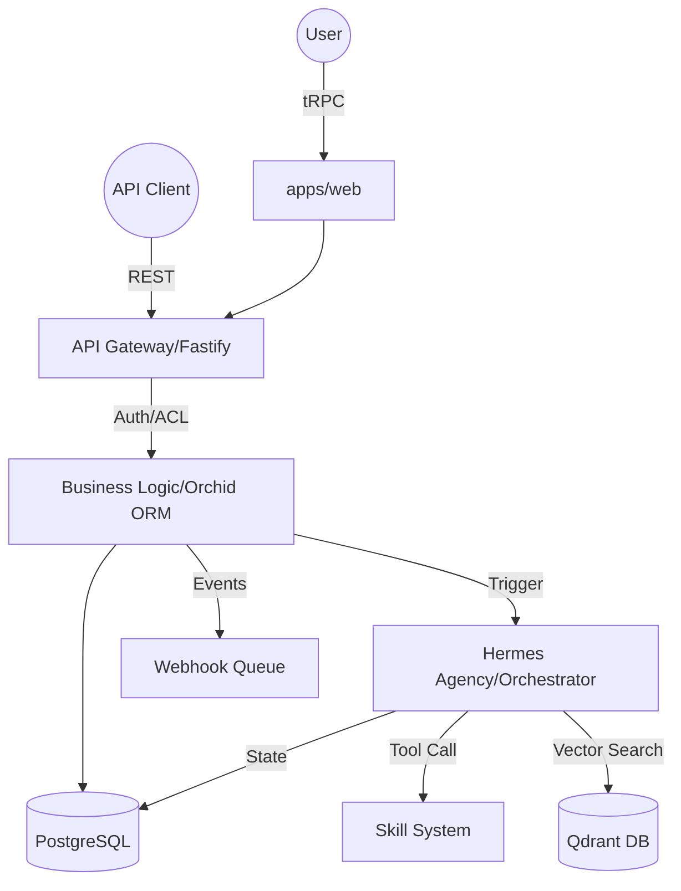

# Data Flow & Integrations

The system is designed as a distributed monorepo where data flows through three primary channels: internal **tRPC** communication for the web interface, a secured **REST API Gateway** for external consumers, and an asynchronous **Orchestration engine** for complex workflow execution.

## Core Data Architecture

Data enters the system via the `apps/web` (React) frontend or external API consumers. The `apps/api` service acts as the central traffic controller, enforcing session security and multi-tenant isolation before persisting data to PostgreSQL via Orchid ORM.

### Module Dependencies

- **apps/web**: Consumes `packages/trpc` for type-safe API calls and uses `packages/zod-schemas` for client-side validation.
- **apps/api**: The core persistence layer, depending on `packages/db` for schema definitions and `packages/zod-schemas` for request/response validation.
- **apps/hermes-agency**: Acts as the orchestration and LLM interface layer, interacting with `packages/db` for state management.
- **apps/ai-gateway**: A specialized proxy layer for AI-specific workloads, handling model routing and filtering (e.g., `ptbr-filter.ts`).

## Service Layer Responsibilities

The logic is modularized across specialized services to ensure high availability and maintainability:

- **Auth Service** (`apps/api/src/modules/auth/session.auth.utils.ts`): Manages session lifecycles, OAuth2 flows (Google), and cookie-based security.
- **Subscription Tracker** (`apps/api/src/modules/api-gateway/utils/subscriptionTracker.utils.ts`): Monitors usage quotas in real-time, enforcing limits and triggering threshold alerts.
- **Agency Router** (`apps/hermes-agency/src/router/agency_router.ts`): Orchestrates calls between various AI "skills" and model providers.
- **Webhook Emitter**: (Managed via `WebhookCallQueueTable`) Handles asynchronous outbound event delivery with built-in retry logic.

## High-Level Pipeline

The system follows a **"Request-Validate-Execute-Notify"** pattern:

1.  **Ingress**: A request hits the Fastify server in `apps/api` or `apps/ai-gateway`.
2.  **Middleware Chain**:
    - **Authentication**: Validated via `sessionSecurity.middleware.ts` (Web) or `apiKeyAuth.middleware.ts` (API).
    - **Validation**: Input is parsed against Zod schemas from `packages/zod-schemas`.
    - **Usage Credits**: Subscription status is checked via `subscriptionTracker.utils.ts`.
3.  **Processing**:
    - **Synchronous**: Direct DB interaction via Orchid ORM for CRUD operations.
    - **Asynchronous**: For AI or long-running tasks, the request is routed to the Agency engine.
4.  **State Transition**: The database reflects the new state (e.g., `KanbanCardsTable` updates or `ServiceOrderTable` entries).
5.  **Egress**: Results are returned to the client, and side-effect events (like 90% quota webhooks) are queued for delivery.

### Data Flow Diagram

## External Integrations

### Identity & Access
- **Google OAuth2**: Handled in `apps/api/src/modules/auth/oauth2`. It manages the Authorization Code Flow to establish user sessions.
- **API Keys**: Distributed to teams for programmatic access to the AI Gateway, validated against the `SubscriptionsTable`.

### AI & LLM Infrastructure
- **Model Context Protocol (MCP)**: Facilitated by `apps/api/src/modules/mcp-connectors`, allowing the AI to interact with external tools like Claude or custom local services.
- **Vector Storage**: `apps/hermes-agency/src/qdrant/client.ts` manages embeddings for RAG (Retrieval-Augmented Generation) workflows.
- **STT/TTS**: Specialized routes in `apps/ai-gateway` handle audio transcription and speech synthesis using local model bridges (Whisper, Kokoro).

### Notification Pipeline
- **Webhooks**: Outbound events are stored in `WebhookCallQueueTable`.
- **Strategy**: Max 3 retries with exponential backoff.
- **Status Tracking**: Deliveries are logged in `WebhookDeliveriesTable` for auditing.

## Observability & Failure Modes

- **Request Logging**: Every external API call is recorded in `ApiProductRequestLogsTable`, capturing latency, status codes, and IP metadata.
- **Dead-Letter Handling**: Tasks or webhooks that exhaust retry attempts are marked as `Failed` for manual intervention.
- **Session Security**: The system implements tiered security levels (`SessionSecurityLevel`) to differentiate between standard user actions and administrative changes.
- **Quota Management**: Real-time tracking triggers `checkAndQueueWebhookAt90Percent` to notify users before they hit hard limits.

---
**Cross-References:**
- See `packages/zod-schemas` for defined data structures.
- See `apps/api/src/routers/trpc.router.ts` for the web interface surface area.
