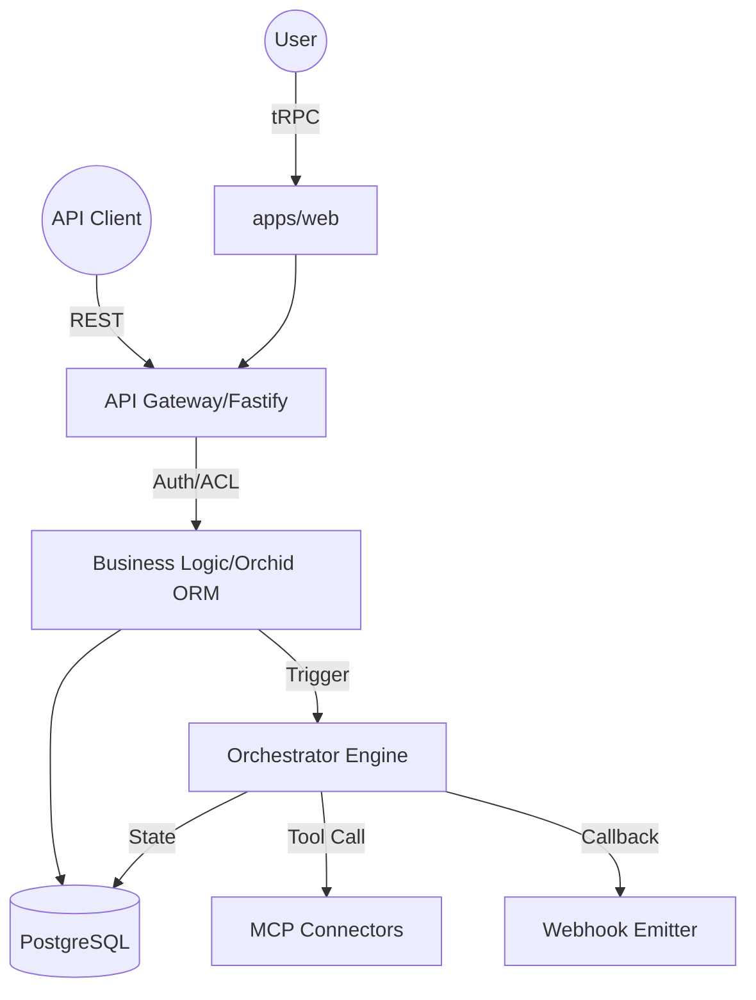

# Document Structure: Data Flow & Integrations

**Type:** doc  
**Tone:** technical  
**Audience:** architects  
**Description:** How data moves through the system and external integrations

## Data Flow & Integrations

The system operates as a distributed monorepo where data flows primarily through three distinct channels: internal tRPC communication for the web interface, a secured REST API Gateway for external consumers, and an asynchronous Orchestration engine for workflow execution.

Data enters the system via the `apps/web` (React) frontend or external API consumers. The `apps/api` service acts as the central traffic controller, enforcing session security and multi-tenant isolation before persisting data to PostgreSQL via Orchid ORM. For complex logic, the `apps/orchestrator` manages stateful transitions and external tool calls (MCP), ensuring that long-running operations do not block the primary request-response cycle.

## Module Dependencies

- **apps/web** → `packages/trpc`, `packages/ui`, `packages/zod-schemas`
- **apps/api** → `packages/db`, `packages/zod-schemas`, `packages/env`
- **apps/orchestrator** → `packages/db`, `packages/zod-schemas`, `apps/api` (via shared tables)
- **packages/db** → `packages/zod-schemas`, `packages/env`
- **packages/trpc** → `packages/zod-schemas`, `apps/api` (server definitions)

## Service Layer

The service layer is abstracted into specialized modules within the API and Orchestrator apps:

- **Auth Service**: `apps/api/src/modules/auth/session.auth.utils.ts` - Manages session lifecycle and security.
- **Workflow Engine**: `apps/orchestrator/src/core/workflow-engine.ts` - Orchestrates multi-step state machines.
- **Approval Gate Service**: `apps/orchestrator/src/modules/human-gates/approval-service.ts` - Handles human-in-the-loop interventions.
- **MCP Adapter Service**: `apps/orchestrator/src/modules/mcp/mcp-adapter.ts` - Standardizes communication with Model Context Protocol servers.
- **Webhook Emitter**: `apps/orchestrator/src/modules/webhooks/webhook-emitter.ts` - Manages outbound event delivery.
- **Subscription Tracker**: `apps/api/src/modules/api-gateway/utils/subscriptionTracker.utils.ts` - Monitors and enforces usage quotas.

## High-level Flow

The primary pipeline follows a "Request-Validate-Execute-Notify" pattern:

1.  **Ingress**: A request arrives at the Fastify server (`apps/api`).
2.  **Middleware Chain**: 
    - Session or API Key validation occurs.
    - Rate limiting and IP whitelisting are enforced via `teamRateLimitHook` and `ipWhitelistCheckHook`.
    - Subscription credits are checked and decremented.
3.  **Processing**: 
    - For CRUD, the `AppTrpcRouter` interacts directly with the database.
    - For complex workflows, a message is emitted to the `OrchestratorEngine`.
4.  **State Transition**: The `WorkflowStateMachine` progresses the task, potentially calling external AI models or MCP tools.
5.  **Egress**: Results are returned to the client, and side effects (like 90% quota alerts) are queued in the `WebhookCallQueueTable`.

## Internal Movement

Modules collaborate through a combination of shared database state and an internal `EventBus`:

- **Shared Database**: The `apps/api` and `apps/orchestrator` share access to the same PostgreSQL instance, allowing the Orchestrator to monitor tables like `KanbanCardsTable` or `ServiceOrderTable` for changes.
- **Event Bus**: Within the orchestrator, the `EventBus` class facilitates decoupled communication between the engine and notification services.
- **Internal API**: High-privilege actions (like manual webhook processing) are triggered via an internal router protected by `INTERNAL_API_SECRET`.

## External Integrations

- **Google OAuth2**:
    - **Purpose**: Identity provider for user login.
    - **Auth**: Authorization Code Flow.
    - **Payload**: User profile (email, name, picture).
- **Model Context Protocol (MCP)**:
    - **Purpose**: Extending AI capabilities with external tools (Claude, Zapier, Make).
    - **Adapters**: `ClaudeMcpAdapter`, `ZapierMcpAdapter`.
    - **Retry**: Handled by the Orchestrator step definition with exponential backoff.
- **Customer Webhooks**:
    - **Purpose**: Real-time quota alerts and system events.
    - **Authentication**: Bearer tokens defined per team.
    - **Strategy**: Max 3 retries with exponential backoff.

## Observability & Failure Modes

- **Request Logging**: Every external API call is recorded in `ApiProductRequestLogsTable`, capturing latency, status codes, and security metadata (IP/UA).
- **Failure Recovery**: The `OnFailureDefinition` in workflows allows for compensating actions or transitions to an "Error" state in the `WorkflowStateMachine`.
- **Dead-Letter Handling**: Webhooks that exhaust their 3 retry attempts are marked as `Failed` in the `WebhookCallQueueTable` for manual audit and replay.
- **Metrics**: Subscription usage is tracked in real-time, triggering 90% threshold webhooks to prevent hard-stops for clients.

---
**Cross-References:**
- See [architecture.md](./architecture.md) for detailed package structures.
- See [security.md](./security.md) for details on the API Gateway middleware implementation.
