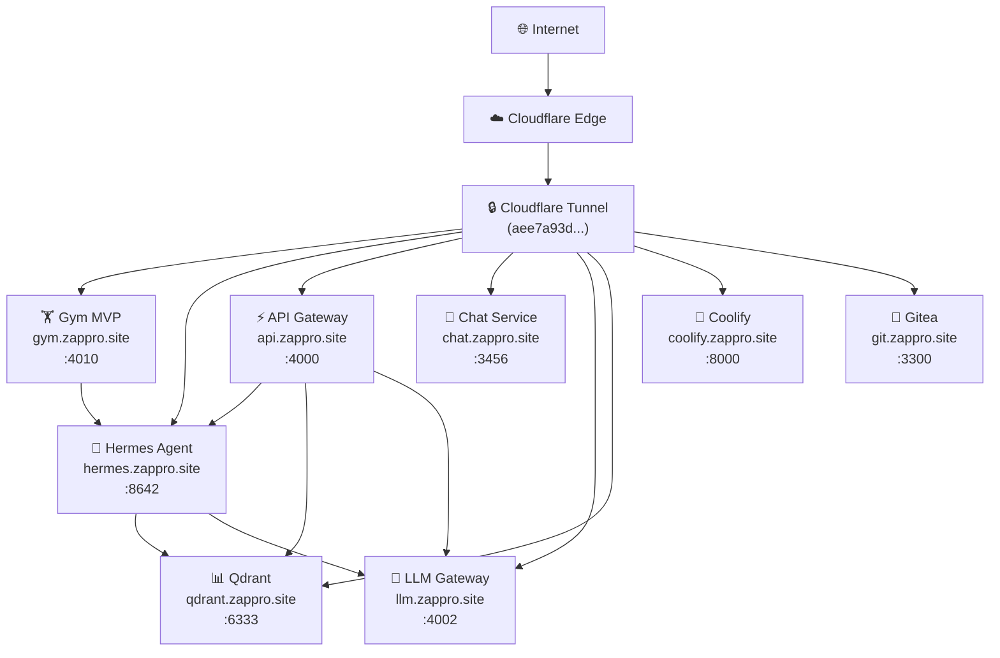

# 🏠 Homelab Monorepo — Enterprise Platform

[](https://gym.zappro.site)
[]()
[]()

> **AI-powered homelab orchestration platform** — Multi-agent orchestration, RAG infrastructure, and SRE automation for self-hosted AI services.

## 🎯 Overview

This monorepo powers [zappro.site](https://zappro.site), a self-hosted AI platform featuring:

- **AI Agent Gateway** — Hermes multi-agent orchestration with Mem0 memory
- **Vector RAG** — Qdrant-powered retrieval augmented generation
- **LLM Proxy** — LiteLLM multi-provider gateway (Ollama, MiniMax, Groq)
- **SRE Automation** — Nexus framework for observability and incident response
- **Git Hosting** — Gitea with multi-agent CI/CD

## 🏗️ Architecture



## 📊 Service Health

| Service | Status | URL | Port |
|---------|--------|-----|------|
| Gym MVP | ✅ Healthy | `https://gym.zappro.site` | 4010 |
| Hermes Agent | ✅ Healthy | `https://hermes.zappro.site` | 8642 |
| API Gateway | ✅ Healthy | `https://api.zappro.site` | 4000 |
| Chat Service | ✅ Healthy | `https://chat.zappro.site` | 3456 |
| LLM Gateway | ✅ Healthy | `https://llm.zappro.site` | 4002 |
| Qdrant DB | ✅ Healthy | `https://qdrant.zappro.site` | 6333 |
| Coolify PaaS | ✅ Healthy | `https://coolify.zappro.site` | 8000 |
| Gitea Git | ✅ Healthy | `https://git.zappro.site` | 3300 |
| PGAdmin | ✅ Healthy | `https://pgadmin.zappro.site` | 4050 |

**Verify:** `nexus-investigate.sh all 3`

## 📁 Directory Structure

### `/srv/` — Core Services

| Directory | Purpose | Status |
|-----------|---------|--------|
| `monorepo/` | **THIS REPO** — Nexus + Hermes + Mem0 | ✅ ACTIVE |
| `ops/` | Infrastructure as Code (Terraform) | ✅ ACTIVE |
| `hermes-second-brain/` | Mem0-backed knowledge graph | ✅ ACTIVE |
| `fit-tracker-v2/` | Fitness tracking app | ✅ ACTIVE |
| `hvacr-swarm/` | HVAC automation | ✅ ACTIVE |
| `edge-tts/` | Edge TTS service | ✅ ACTIVE |
| `data/` | ZFS persistent volumes | ✅ ACTIVE |
| `backups/` | Backup storage | ✅ ACTIVE |
| `docker-data/` | Docker volumes | ✅ ACTIVE |
| `models/` | Ollama LLM models | ✅ ACTIVE |
| `archive/` | Archived projects | ✅ ORGANIZED |

### `/home/will/` — Ubuntu Desktop LTS

| Directory | Purpose | Status |
|-----------|---------|--------|
| `pc-cel/` | RustDesk remote control | ✅ ACTIVE |
| `go/` | Go modules (gentle-ai, gopls) | ✅ ACTIVE |
| `dev/skills/` | Homelab skills | ✅ ACTIVE |
| `mcp-data/memory-keeper/` | Context database | ✅ ACTIVE |
| `obsidian-vault/` | Personal notes | ✅ ACTIVE |
| `.local/bin/codex` | Codex CLI 0.124.0 | ✅ ACTIVE |

## 🤖 Nexus SRE Framework

**7 Modes × 7 Agents = 49 Specializations**

| Mode | Agents |
|------|--------|
| debug | log-diagnostic, stack-trace, perf-profiler, network-tracer, security-scanner, sre-monitor, incident-response |
| test | unit-tester, integration-tester, e2e-tester, coverage-analyzer, boundary-tester, flaky-detector, property-tester |
| backend | api-developer, service-architect, db-migrator, cache-specialist, auth-engineer, event-developer, file-pipeline |
| frontend | component-dev, responsive-dev, state-manager, animation-dev, a11y-auditor, perf-optimizer, design-system |
| review | correctness-reviewer, readability-reviewer, architecture-reviewer, security-reviewer, perf-reviewer, dependency-auditor, quality-scorer |
| docs | api-doc-writer, readme-writer, changelog-writer, inline-doc-writer, diagram-generator, adr-writer, doc-coverage-auditor |
| deploy | docker-builder, compose-orchestrator, coolify-deployer, secret-rotator, rollback-executor, zfs-snapshotter, health-checker |

## 🚀 Quick Start

```bash
# Clone
git clone https://git.zappro.site/will-zappro/monorepo.git
cd monorepo

# Install dependencies
pnpm install

# Development
pnpm dev

# Production build
pnpm build

# Type check
pnpm tsc --noEmit
```

## 🔐 Security Governance

- All secrets via `.env` — never hardcoded
- See `.env.example` for template
- Cloudflare tunnel authentication via Global Key
- ZFS snapshots before risky operations

## 📖 Documentation

| Document | Description |
|---------|-------------|
| [AGENTS.md](AGENTS.md) | Multi-agent orchestration + full infrastructure map |
| [CLAUDE.md](CLAUDE.md) | Agent instructions + security rules |
| [NEXUS-SRE-GUIDE.md](docs/NEXUS-SRE-GUIDE.md) | SRE automation, health checks, cron jobs |
| [SPECs/](docs/SPECS/) | Feature specifications |
| [docs/README.md](docs/README.md) | Documentation index |
| [/srv/hermes-second-brain/CLAUDE.md](/srv/hermes-second-brain/CLAUDE.md) | Knowledge graph docs |

## 📊 Status

- **Services:** 9/9 Healthy ✅
- **Architecture Violations:** 0
- **Empty Files:** 0
- **Pending Alerts:** 0

---

**MIT License** — Copyright © 2026 [zappro.site](https://zappro.site)
