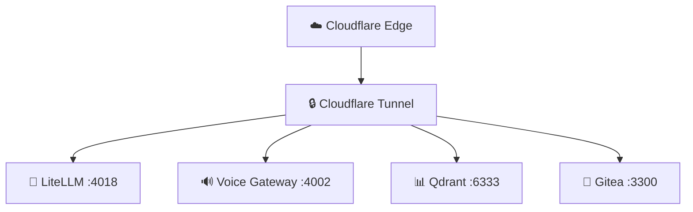

# 🏠 Homelab Monorepo

[]()
[]()

> Self-hosted AI platform powering [zappro.site](https://zappro.site).  
> **Regra:** 2 gateways only (LiteLLM & Voice). Tudo que não for esses dois é lixo.

## 🗂️ Repos do Homelab em `/srv`

| Repo | Caminho | Papel |
|------|---------|-------|
| `monorepo` | `/srv/monorepo` | Apps, docs e engine principal |
| `homelab-context` | `/srv/homelab-context` | Contexto compartilhado |
| `nexus` | `/srv/nexus` | Router local/cloud |

## 🏗️ Arquitetura



## 📁 Estrutura

```
apps/
  api/          # Backend (Fastify + tRPC)
  web/          # Frontend (React + MUI)
  ai-gateway/   # Voice Gateway :4002
packages/
  ui/           # Component library
  zod-schemas/  # Source of truth (Zod)
  config/       # Global config
scripts/
  hvac-rag/     # Core HVAC Inverter Engine
```

## 🚀 Quick Start

```bash
pnpm install
pnpm dev
pnpm build && biome check .
```

## 📚 Docs

- [AGENTS.md](AGENTS.md) — Regras de governança e mapa de apps
- [.planning/](.planning/) — Milestones e requisitos
- [docs/RUNBOOKS/](docs/RUNBOOKS/) — Operação e manutenção
