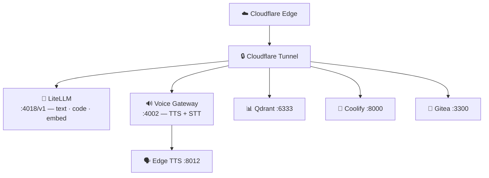

# 🏠 Homelab Monorepo

[]()
[]()
[]()

> Self-hosted AI platform powering [zappro.site](https://zappro.site).  
> **Regra:** 2 gateways only. Tudo que não for esses dois é lixo.

## 🗂️ Repos do Homelab em `/srv`

Este repo é o control plane principal, mas não é o único repo vivo no host.

| Repo | Caminho | Papel |
|------|---------|-------|
| `monorepo` | `/srv/monorepo` | Apps, docs e runtime principal |
| `homelab-context` | `/srv/homelab-context` | Contexto compartilhado para agentes |
| `nexus` | `/srv/nexus` | Router local-first / cloud-fallback |
| `ops` | `/srv/ops` | Infra, governança e utilitários operacionais |
| `hvac-pipeline` | `/srv/hvac-pipeline` | Pipeline HVAC e utilitários RAG |

Referência canônica: [docs/HOMELAB.md](docs/HOMELAB.md).

## 🏗️ Arquitetura — Mínimo Viável



## 📊 Serviços Core

| Serviço | Porta | Função |
|---------|-------|--------|
| **LiteLLM** | `:4018/v1` | Gateway único LLM (hermes-* aliases) |
| **Voice Gateway** | `:4002` | TTS (Edge) + STT (Groq cloud) |
| **Qdrant** | `:6333` | Vector DB |
| **Coolify** | `:8000` | PaaS deploy |
| **Gitea** | `:3300` | Git + CI/CD |

**Health:** `bash scripts/sre-check.sh ci --json`

## 🚀 Quick Start

```bash
# 1. Install
pnpm install

# 2. Dev (turbo)
pnpm dev

# 3. Build + lint
pnpm build && biome check .
```

## 📁 Estrutura

```
apps/
  api/          # CRM backend (Fastify + tRPC)
  web/          # Frontend (React + MUI)
  ai-gateway/   # Voice Gateway :4002
packages/
  ui/           # Component library
  zod-schemas/  # Shared schemas
  config/       # Shared config
scripts/        # SRE + RAG pipelines
services/
  orchestrator/ # Hermes JSON-RPC
```

## 📚 Docs

- [AGENTS.md](AGENTS.md) — Source of truth para agents
- [docs/INFRASTRUCTURE/](docs/INFRASTRUCTURE/) — Arquitetura, ports, services
- [docs/SPECS/](docs/SPECS/) — SPECs ativas
- [docs/OPERATIONS/](docs/OPERATIONS/) — Runbooks

---

*Less is more. Um repositório com 50 arquivos bem organizados vale mais que um com 500 em salada.*
