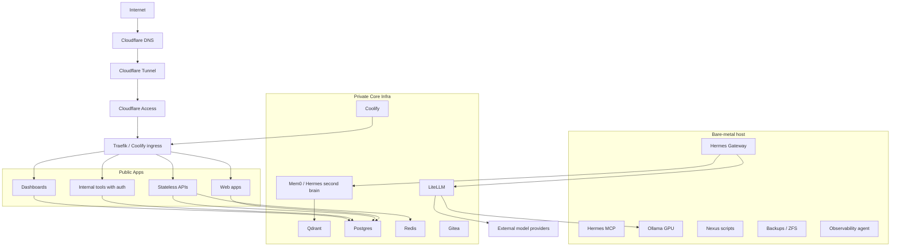

# Architecture Overview — Homelab Monorepo

**Data:** 2026-04-14
**Fonte:** SPEC-045

---

## 1. Infrastructure Stack (TL;DR)

| Service    | Onde                      | Purpose                            | Access              |
| ---------- | ------------------------- | ---------------------------------- | ------------------- |
| Coolify    | Ubuntu Desktop:8000       | Container management (PaaS)        | coolify.zappro.site |
| Ollama     | localhost:11434           | LLM inference (GPU local RTX 4090) | via LiteLLM :4000   |
| Qdrant     | Coolify                   | Vector database                    | localhost:6333      |
| Hermes     | Ubuntu Desktop bare metal | Agent brain + messaging            | hermes.zappro.site  |
| LiteLLM    | Docker Compose            | LLM proxy + rate limiting          | localhost:4000      |
| Grafana    | Docker Compose            | Metrics dashboards                 | monitor.zappro.site |
| Loki       | Docker Compose            | Log aggregation                    | via Grafana         |
| Prometheus | Docker Compose            | Metrics collection                 | via Grafana         |
| MCPO       | Ubuntu bare metal         | MCP proxy                          | localhost:8092      |

---

## 2. Stack Topology

```
                    ┌─────────────────────────────────────┐
                    │         Cloudflare Tunnel            │
                    │  (cloudflared — SSL termination)      │
                    └──────┬──────┬──────┬──────┬────────┘
                           │      │      │      │
              coolify.    chat.   api.  list.  hermes.
              zappro.site zappro.site      zappro.site
                           │      │      │      │
                    ┌──────▼──────▼──┐   │      │
                    │  Coolify Proxy │   │      │
                    │  (Traefik)    │   │      │
                    └───┬────────────┘   │      │
                        │                │      │
              ┌─────────▼─────────────────▼──────▼─────┐
              │           Docker Network (Coolify)      │
              │                                         │
              │  ┌──────────────────────────────────┐  │
              │  │  qdrant (Coolify managed)        │  │
              │  │  port: 6333                      │  │
              │  └──────────────────────────────────┘  │
              │  ┌──────────────────────────────────┐  │
              │  │  open-webui (Coolify managed)   │  │
              │  │  port: 8080                     │  │
              │  └──────────────────────────────────┘  │
              └────────────────────────────────────────┘
                          │
              ┌───────────▼────────────────────────────────┐
              │  Ubuntu Desktop (bare metal)              │
              │                                            │
              │  ┌──────────────────────────────────────┐  │
              │  │  Hermes Agent v0.9.0                │  │
              │  │  gateway :3001  |  mcp :8092        │  │
              │  │  Telegram polling                    │  │
              │  └──────────────────────────────────────┘  │
              │                                            │
              │  ┌──────────────────────────────────────┐  │
              │  │  Ollama (RTX 4090)                  │  │
              │  │  port: 11434 | model: qwen2.5vl:7b │  │
              │  └──────────────────────────────────────┘  │
              │                                            │
              │  ┌──────────────────────────────────────┐  │
              │  │  Docker Compose stack               │  │
              │  │  - LiteLLM (:4000)                 │  │
              │  │  - Grafana (:3100)                 │  │
              │  │  - Loki (:3101)                    │  │
              │  │  - Prometheus (:9090)               │  │
              │  │  - nginx-ratelimit-*                │  │
              │  │  - openwebui-bridge-agent (:3456) │  │
              │  └──────────────────────────────────────┘  │
              └────────────────────────────────────────────┘
```

---

## 3. Services Inventory

| Service        | Type            | Host              | Port   | Purpose               |
| -------------- | --------------- | ----------------- | ------ | --------------------- |
| Coolify        | PaaS            | Ubuntu Desktop    | 8000   | Container management  |
| Coolify Proxy  | Reverse Proxy   | Ubuntu Desktop    | 80/443 | SSL termination       |
| Qdrant         | Vector DB       | Coolify           | 6333   | RAG / embeddings      |
| OpenWebUI      | Web UI          | Coolify           | 8080   | Chat interface        |
| Hermes Gateway | Agent           | Ubuntu bare metal | 3001   | Agent brain           |
| Hermes MCP     | MCP Server      | Ubuntu bare metal | 8092   | MCP proxy             |
| Ollama         | LLM Engine      | Ubuntu Desktop    | 11434  | Local inference       |
| LiteLLM        | LLM Proxy       | Docker Compose    | 4000   | Multi-provider proxy  |
| Grafana        | Dashboards      | Docker Compose    | 3100   | Metrics visualization |
| Loki           | Log aggregation | Docker Compose    | 3101   | Centralized logs      |
| Prometheus     | Metrics         | Docker Compose    | 9090   | Metrics collection    |
| MCPO           | MCP Proxy       | Ubuntu bare metal | 8092   | MCP protocol bridge   |

---

## 4. Secrets Inventory

| Secret               | Location | Used By                         |
| -------------------- | -------- | ------------------------------- |
| COOLIFY_API_KEY      | .env     | Claude Code, hermes-coolify-cli |
| CLOUDFLARE_API_TOKEN | .env     | Terraform, cloudflared          |
| GITEA_ACCESS_TOKEN   | .env     | Git push, CI                    |
| MINIMAX_API_KEY      | .env     | LiteLLM, Hermes                 |
| TELEGRAM_BOT_TOKEN   | .env     | Hermes Gateway                  |

**Regra:** All secrets sourced from `.env` (canonical).

---

## 5. Quick Reference

### Coolify (Container Management)

- **O que e:** PaaS para gerir containers Docker
- **Como aceder:** https://coolify.zappro.site
- **API:** http://localhost:8000/api/v1
- **Skills:** `.claude/skills/coolify-access/`

### Ollama (Local LLM)

- **O que e:** Inference engine local (RTX 4090)
- **Modelo:** qwen2.5vl:7b
- **Como aceder:** localhost:11434
- **Usado por:** LiteLLM, Hermes, Perplexity Agent

---

## 6. Governance Rules Summary

| Rule                 | Where            | Description                                           |
| -------------------- | ---------------- | ----------------------------------------------------- |
| Coolify as PaaS      | This doc         | All containers via Coolify except Hermes (bare metal) |
| .env canonical       | docs/GOVERNANCE/ | All secrets via .env                                 |
| Immutable services   | docs/GOVERNANCE/ | SPEC-009, SPEC-027, SPEC-029 protected                |
| Port governance      | PORTS.md         | Check before using new ports                          |
| Subdomain governance | SUBDOMAINS.md    | Check before adding subdomains                        |


---

## ARCHITECTURE DETAIL

│   │  • Hermes MCP :8092 (MCPO bridge para Claude Code)         │
│   │  • Ollama :11434 (RTX 4090 — Gemma4 local)                 │
│   │  • zappro-api :4003 (FastAPI auth JWT)                     │
│   │  • ai-gateway :4002 (OpenAI-compat facade — TTS/STT/Vision)│
│   │  • opencode-go :9000 (OpenCode CLI)                        │
│   └─────────────────────────────────────────────────────────────┘
│
├── ┌─────────────────────────────────────────────────────────────┐
├── │  Docker Compose Stack                                       │
│   │  • LiteLLM :4000 (multi-provider proxy — MiniMax/GPT)     │
│   │  • Grafana :3100 (dashboards)                              │
│   │  • Loki :3101 (logs)                                      │
│   │  • Prometheus :9090 (metrics)                              │
│   │  • Qdrant :6333 (vector DB — RAG)                          │
│   │  • ai-router :4005 (routing inteligente)                   │
│   │  • nginx-ratelimit :4004 (rate limiting → :4000)           │
│   └─────────────────────────────────────────────────────────────┘
│
└── PC SECUNDARIO (Gen3 1TB NVMe + RTX 3060 12GB + 32GB RAM)
    └── Dashboard principal (SSH para PC principal)
```

---

## 2. Ordem de Carregamento de Contexto (Obligatoria)

Antes de qualquer tarefa, ler nesta ordem:

```bash
# 1. Monorepo AGENTS.md (source of truth para processos)
cat /srv/monorepo/AGENTS.md | tail -200

# 2. Second Brain TREE (mapeia estrutura de conhecimento)
cat ~/Desktop/hermes-second-brain/TREE.md 2>/dev/null || ls ~/Desktop/hermes-second-brain/

# 3. OPS Governance (regras operacionais)
cat /srv/ops/ai-governance/README.md 2>/dev/null
cat /srv/ops/ai-governance/CONTRACT.md 2>/dev/null

# 4. Sistema atual (se mudanca de infra)
cat ~/Desktop/SYSTEM_ARCHITECTURE.md 2>/dev/null
```

---

## 3. Projetos

| Projeto | Path | Tipo | Stack |
|---------|------|------|-------|
| **Monorepo** | `/srv/monorepo` | pnpm workspaces + Fastify/tRPC | TypeScript, Biome |
| **Second Brain** | `~/Desktop/hermes-second-brain` | Obsidian-style vault | Markdown, Git |
| **Hermes Agent** | `~/.hermes/hermes-agent` | Python asyncio | Claude Code, MCP |
| **OPS Scripts** | `/srv/ops/scripts` | Bash + Terraform | Docker, ZFS |

### 3.1 Monorepo — Estrutura

```
/srv/monorepo/
├── apps/                    # Aplicacoes deployaveis
├── packages/                # Bibliotecas compartilhadas
│   └── zod-schemas/        → Validacao Zod-first (unica fonte)
├── docs/
│   ├── SPECS/              → SPEC-XXX.md (specs ativos)
│   └── INFRASTRUCTURE/
│       ├── PORTS.md        → Mapa de portas (OBRIGATORIO atualizar)
│       └── SUBDOMAINS.md   → Subdominios Cloudflare
├── orchestrator/           → Pipeline de 3 fases
│   └── scripts/
│       ├── run-pipeline.sh
│       ├── snapshot.sh
│       └── rollback.sh
└── .claude/
    └── skills/orchestrator/logs/  → Logs dos agentes
```

### 3.2 Second Brain

Vault Obsidian-style em `~/Desktop/hermes-second-brain/` com:
- TREE.md — mapeia toda a estrutura de conhecimento
- Notas interconnectadas para pesquisa rapida
- Sincronizado via Git

### 3.3 Hermes Agent

Python asyncio agent que executa em `~/.hermes/hermes-agent`:
- Telegram bot para triggers
- Voice agent com Edge TTS + Groq Whisper
- MCP bridge via Hermes MCP :8092

---

## 4. Setup de Hardware

### PC Principal

```
CPU:    Gen5 (generacao atual)
NVMe:   4TB (RAID-Z ZFS pool)
GPU:    RTX 4090 24GB (VRAM — 23GB livre quando Gemma4 nao carregado)
RAM:    64GB
OS:     Ubuntu Server (headless)
Rede:   SSH so via PC secundario
ZFS:    tank (4TB RAID-Z)
```

### PC Secundario

```
CPU:    Gen3
NVMe:   1TB
GPU:    RTX 3060 12GB
RAM:    32GB
OS:     Dashboard principal
Funcao: SSH para PC principal, monitor, terminal
```

### VRAM Strategy

- **Gemma4:26b-q4** carregado sob demanda (22GB VRAM)
- **LiteLLM** faz pooling automatico entre MiniMax/GPT
- Quando Gemma4 carregado: VRAM disponivel cai para ~1GB

---

## 5. Topologia de Servicos

### 5.1 Ports Ativos (Nao Usar)

| Port | Servico | Host | Proposito |
|------|---------|------|-----------|
| :3000 | zappro-web | Ubuntu Desktop | React chat UI (dark mode) |
| :4000 | LiteLLM | Docker Compose | Production LLM proxy |
| :4002 | ai-gateway | Ubuntu Desktop | OpenAI-compat facade (TTS/STT/Vision) |
| :4003 | zappro-api | Ubuntu Desktop | FastAPI auth JWT + proxy LiteLLM |
| :8000 | Coolify | Ubuntu Desktop | Container management (PaaS) |
| :8080 | OpenWebUI | Coolify | Chat interface |
| :8092 | Hermes MCP | Ubuntu bare metal | MCPO bridge (Claude Code) |
| :3001 | Hermes Gateway | Ubuntu bare metal | Telegram bot + voice agent |
| :6333 | Qdrant | Coolify | Vector DB (RAG/embeddings) |

### 5.2 Ports Livres para Dev

| Faixa | Uso |
|-------|-----|
| 4004–4099 | Microservicos (dev) |
| :5173 | Vite frontend dev |

### 5.3 Diagrama de Conectividade

```
                        Cloudflare Tunnel
                    (cloudflared — SSL termination)
                              │
            ┌─────────────────┼─────────────────┐
            │                 │                 │
     coolify.zappro.    hermes.zappro.    api.zappro.
           site             site              site
            │                 │                 │
     ┌──────▼──────┐   ┌──────▼──────┐   ┌──────▼──────┐
     │   Traefik   │   │  Cloudflared│   │  Cloudflared│
     │  (Coolify)  │   │  Tunnel     │   │  Tunnel     │
     └──────┬──────┘   └──────┬──────┘   └──────┬──────┘
            │                 │                 │
     ┌──────▼──────┐   ┌──────▼──────┐   ┌──────▼──────┐
     │   Coolify   │   │  Hermes    │   │   LiteLLM   │
     │   PaaS      │   │  Gateway   │   │   Proxy     │
     │   :8000     │   │  :3001     │   │   :4000     │
     └──────┬──────┘   └──────┬──────┘   └──────┬──────┘
            │                 │                 │
     ┌──────▼──────┐   ┌──────▼──────┐   ┌──────▼──────┐
     │   Qdrant    │   │  Hermes    │   │   Ollama    │
     │   :6333     │   │  MCP :8092 │   │  (RTX 4090) │
     └─────────────┘   └────────────┘   │  :11434     │
                                         └─────────────┘
```

---

## 6. Pipeline de Voice (TTS + STT)

### 6.1 TTS — Edge TTS (Microsoft Neural)

```bash
# Script canonico
~/.hermes/scripts/tts-edge.sh "texto" 7220607041
```

- **Motor:** Microsoft Edge TTS (voz AntonioNeural PT-BR)
- **Integracao:** Via ai-gateway :4002
- **Voz:** AntonioNeural (PT-BR) — neural de alta qualidade

### 6.2 STT — Groq Whisper Turbo

```bash
# Transcrever audio
curl -X POST https://api.groq.com/openai/v1/audio/transcriptions \
  -H "Authorization: Bearer $GROQ_API_KEY" \
  -F "file=@audio.ogg" \
  -F "model=whisper-large-v3-turbo"
```

- **Motor:** Groq Whisper Turbo (150min/dia gratis)
- **Integracao:** Via ai-gateway :4002
- **Vantagem:** Nao requer GPU local, transcricao rapida via Groq

### 6.3 Diagrama do Pipeline de Voice

```
                        VOICE PIPELINE
    ┌──────────────────────────────────────────────────────┐

    TEXT INPUT                              AUDIO OUTPUT
        │                                       ▲
        │                                       │
    ┌───▼────────────────┐              ┌──────┴──────┐
    │  Claude Code /     │              │  Edge TTS   │
    │  Hermes Gateway    │              │  AntonioNeural │
    └───┬────────────────┘              └─────────────┘
        │                                       ▲
        │                                       │ HTTP
        │                                  ┌────┴────┐
        │                                  │ai-gateway│
        │                                  │  :4002   │
        │                                  └────┬────┘
        │                                       │
   ┌────▼────────────────────┐                  │
   │  Groq Whisper Turbo     │                  │
   │  (whisper-large-v3-turbo│                  │
   └────┬────────────────────┘                  │
        │                                       │
   AUDIO INPUT                                  │
        │                                       │
   ┌────▼────────────────────┐                  │
   │  ai-gateway :4002       │──────────────────┘
   │  (OpenAI-compat facade) │
   └─────────────────────────┘
```

---

## 7. Roteamento de Modelos

### 7.1 Modelos Ativos

| Modelo | Uso | Custo | Provider |
|--------|-----|-------|----------|
| **MiniMax M2.7** | Chat principal | Token plan | LiteLLM :4000 |
| **GPT-4o-mini** | Fallback automatico | $0.15/1M tokens | LiteLLM :4000 |
| **Gemma4:26b-q4** | Codigo local (Ollama) | Grátis | Ollama :11434 |

### 7.2 VRAM Strategy

```
RTX 4090 24GB VRAM:
├── 22GB → Gemma4:26b-q4 (sob demanda)
└── 1-2GB → Reserved (drivers + fallback)
```

- **Gemma4** carregado sob demanda (22GB)
- **LiteLLM** faz pooling automatico entre MiniMax/GPT
- Sem swap no Gen5 (SSD rapido mas wear leveling)

### 7.3 Diagrama de Roteamento

```
                    USER REQUEST
                         │
                         ▼
            ┌────────────────────────┐
            │     LiteLLM Proxy      │
            │       :4000           │
            │  (OpenAI-compat)      │
            └──────────┬───────────┘
                       │
         ┌─────────────┼─────────────┐
         │             │             │
    ┌────▼────┐   ┌────▼────┐   ┌────▼────┐
    │MiniMax  │   │ GPT-4o │   │ Ollama  │
    │ M2.7    │   │ mini   │   │(RTX4090)│
    └─────────┘   └─────────┘   └─────────┘
         │             │             │
         └─────────────┼─────────────┘
                       │
                 RESPONSE
```

---

## 8. MCP Servers

| MCP | Port | Host | Proposito |
|-----|------|------|-----------|
| coolify | 4012 | Docker | Gerenciar Coolify via API |
| ollama | 4013 | Docker | Gerenciar modelos via Ollama API |
| system | 4014 | Docker | ZFS/Docker/System metrics |
| cron | 4015 | Docker | Cron job management |
| qdrant | 4011 | Docker | Vector search + memory (RAG) |
| monorepo | 4006 | Docker | Filesystem + git para monorepo |

---

## 9. Governance Regras

### 9.1 Obrigatorio para Mudancas Estruturais

1. Ler `CONTRACT.md` em `/srv/ops/ai-governance/`
2. Verificar `GUARDRAILS.md` se requer aprovacao
3. Criar ZFS snapshot antes: `sudo zfs snapshot -r tank@pre-$(date +%Y%m%d-%H%M%S)-<motivo>`
4. Documentar em `/srv/ops/ai-governance/logs/`

### 9.2 NUNCA FAZER

```
- wipefs /dev/nvme*           → destroi ZFS pool
- zpool destroy tank           → destroi todos os dados
- rm -rf /srv/data/*           → deleta dados de producao
- rm -rf /srv/backups/*       → deleta backups
- docker volume prune -f      → deleta volumes sem backup
- Bypass Traefik com port forward direto
- Abrir portas sem verificar PORTS.md primeiro
```

### 9.3 Comandos Seguros (sem aprovacao)

```bash
docker ps
docker compose -f /srv/apps/platform/docker-compose.yml ps
zpool status tank
zfs list -t snapshot
# Backups
/srv/ops/scripts/backup-postgres.sh
/srv/ops/scripts/backup-qdrant.sh
```

---

## 10. Debug Quick Reference

```bash
# Status servicos
docker ps | grep -E "qdrant||gitea|coolify"

# Logs recentes
journalctl --user -u hermes-gateway -n 30

# VRAM usage
nvidia-smi

# ZFS health
zpool status tank
zfs list -t snapshot

# LiteLLM health
curl http://localhost:4000/health
```

---

## 11. Anti-Patterns

### ZERO HARDCODING

```python
# CORRETO — carregar de ~/.hermes/secrets.env
from pathlib import Path
_secrets = Path.home() / '.hermes' / 'secrets.env'
if _secrets.exists():
    with open(_secrets) as f:
        for line in f:
            if '=' in line and not line.startswith('#'):
                k, _, v = line.partition('=')
                os.environ[k.strip()] = v.strip()
MY_KEY = os.environ.get('MY_KEY', '')
# Exemplo de anti-pattern (nao fazer):
MY_KEY = ${MY_API_KEY}
```

---

**Atualizado:** 2026-04-22
**Versao:** Blueprint v1.0


---

## ARCHITECTURE STABLE (historical)


---

## 2. Diagrama de Arquitetura

```
                            ┌──────────────────────────────────┐
                            │      Cloudflare Tunnel            │
                            │  api.zappro.site   → :4000       │
                            │ hermes.zappro.site → :8642       │
                            │ qdrant.zappro.site → Qdrant (:6333)│
                            └───────────────┬────────────────────┘
                                           │

  INTERNET ←───────────────────────────────┼──────────────────────────────────────►
                      @CEO_REFRIMIX_bot   │
                      (Telegram)          │
                      │                   │
                      ▼                   │
              ┌──────────────┐            │
              │ Hermes GW     │            │
              │ :8642 (bare) │            │
              │ Python/svc    │            │
              └──────┬───────┘            │
                     │                    │
                     │     ┌─────────────┴─────────────────┤
                     │     ▼                               │
                     │ ┌──────────────────────────────────────────────┐
                     │ │           LiteLLM Proxy (:4000)              │
                     │ │    Groq / MiniMax / OpenAI / Ollama local   │
                     │ └──────────────────────────────────────────────┘
                     │
                     │     ┌────────────────┐     ┌──────────┐
                     │     │ Ollama         │     │ Qdrant   │
                     │     │ :11434 (GPU)   │     │ :6333-34 │
                     │     └────────────────┘     └──────────┘
                     │
                     │                             ┌───────────┴────────┐
                     │                             ▼                    ▼
                     │                      ┌──────────────┐    ┌──────────────┐
                     │                      │ Edge TTS     │    │ LiteLLM-DB   │
                     │                      │ (Microsoft)  │    │ :5432 (PG)   │
                     │                      └──────────────┘    └──────────────┘
          │
          │  ┌──────────────────────────────────────────────────────┐
          │  │  HOST: Ubuntu Desktop bare-metal, RTX 4090, ZFS tank  │
          │  │  grafana :3100 │ node-exp :9100 │ searxng :8080      │
          │  └──────────────────────────────────────────────────────┘
          └──────────────────────────────────────────────────────────┘
```

---

## 3. Catálogo de Serviços

### 3.1 Docker Containers (13 ativos)

| Container | Imagem | Porta | Status | Propósito |
|-----------|--------|-------|--------|-----------|
| `zappro-litellm` | litellm | 4000/tcp | running | Proxy LLM multi-provedor |
| `zappro-litellm-db` | postgres:16 | 5432/tcp | healthy | PostgreSQL (metadados LiteLLM) |
| `zappro-qdrant` | qdrant | 6333-34/tcp | healthy | DB vetorial (RAG/embeddings) |
| `zappro-redis` | redis | 6379/tcp | healthy | Cache/pubsub |
| `zappro-edge-tts` | edge-tts | 8012/tcp | healthy | TTS neural Microsoft |
| `grafana` | grafana | 3100/tcp | running | Dashboards métricas |
| `node-exporter` | node-exp | 9100/tcp | running | Métricas host |
| `searxng` | searxng | 8080/tcp | running | Motor de busca privativo |
| `coolify` | coollabsio/coolify | 8000/tcp | healthy | PaaS container management |
| `coolify-db` | postgres:15-alpine | — | healthy | PostgreSQL Coolify |
| `coolify-redis` | redis:7-alpine | — | healthy | Redis Coolify |
| `coolify-realtime` | coollabsio/coolify-realtime | 6001/tcp | healthy | Soketi realtime |
| `openwebui` | openwebui/open-webui | 3456/tcp | healthy | Chat UI (Ollama integration) |

### 3.2 Bare Metal / Systemd

| Serviço | Porta | Bind | Propósito |
|---------|-------|------|-----------|
| `hermes-gateway.service` | 8642 | 127.0.0.1 | Polling Telegram (brain) |
| `hermes-mcp.service` | 8092 | 127.0.0.1 | Bridge MCPO → Claude Code |
| `ollama.service` | 11434 | 0.0.0.0 | Local LLM inference (RTX 4090) |

| `cloudflared` | 20241/20242 | 127.0.0.1 | Tunnel + métricas |
| `sshd` | 22 | 0.0.0.0 | SSH |
| `postfix` | 25 | 0.0.0.0 | Relay SMTP |

### 3.3 Serviços Presentes mas Inativos (PARADO)

| Serviço | Porta | Status | Observação |
|---------|-------|--------|------------|
| `Mem0` | — | PARADO | Memory service |
| `Trieve` | 6435 | PARADO | RAG system (SPEC-092) |

---

## 4. Portas & Endpoints Ativas

| Porta | Serviço | Bind | Health Check |
|-------|---------|------|-------------|
| 4000 | litellm | 127.0.0.1 | `curl localhost:4000/health` (401 sem key = normal) |
| 5432 | liteLLM-DB | container | `pg_isready` |
| 6333 | qdrant REST | 127.0.0.1 | `curl localhost:6333/readyz` |
| 6334 | qdrant gRPC | 127.0.0.1 | — |
| 6379 | redis | 127.0.0.1 | `docker exec zappro-redis redis-cli ping` |
| 8012 | edge-tts | 127.0.0.1 | `curl localhost:8012/health` |
| 8080 | searxng | * | `curl localhost:8080` |
| 3100 | grafana | * | `curl localhost:3100/api/health` |
| 8642 | hermes-gateway | 127.0.0.1 | `curl localhost:8642/health` |
| 9100 | node-exporter | * | `curl localhost:9100/metrics` |

| 8092 | hermes-mcp | 127.0.0.1 | — |

---

## 5. Fluxo de Dados

### 5.1 Hermes Gateway — Polling (@CEO_REFRIMIX_bot)

```
@CEO_REFRIMIX_bot (Telegram) → Hermes Gateway (:8642 bare-metal)
                                              ↓
                                    LiteLLM (:4000) → Groq/MiniMax/OpenAI
                                              ↓
                                    Redis (:6379) — cache de sessão
                                              ↓
                                    Edge TTS (8012) — resposta de voz
```

### 5.2 RAG Query

```
Client → LiteLLM (:4000) → Qdrant (:6333) — busca vetorial
```

### 5.3 Busca Privativa

```
User → SearXNG (:8080) — motor de busca local, ad-free
```

---

## 6. Stack de Tecnologias

| Camada | Tecnologia |
|--------|-----------|
| **OS** | Ubuntu 24.04 Desktop bare-metal |
| **GPU** | NVIDIA RTX 4090 (CUDA) |
| **Storage** | ZFS tank (nvme0n1 3.6TB Gen5) |
| **Container** | Docker + Docker Compose |
| **LLM Proxy** | LiteLLM (Groq, OpenAI, MiniMax, Ollama) |
| **Vector DB** | Qdrant (RAG/embeddings) |
| **Cache** | Redis (sessão, pub/sub) |
| **DB** | PostgreSQL (metadados LiteLLM) |
| **STT** | Groq Whisper Turbo (cloud) |
| **TTS** | Edge TTS (Microsoft neural) |
| **Agent** | Hermes Gateway (Python, Telegram bot) |
| **Tunnel** | Cloudflared (3 subdomínios) |
| **Monitoring** | Grafana + node-exporter |
| **Search** | SearXNG (privativa) |

---

## 7. Segurança

| Regra | Detalhe |
|-------|---------|
| Bind localhost | Todos Docker em `127.0.0.1` |
| Cloudflare Tunnel | Apenas 3 subdomínios expostos |
| ZFS immutable | Snapshot antes de mudanças estruturais |
| Secrets | `.env` local, nunca em git |

| Bot Telegram | `@CEO_REFRIMIX_bot` |

---

## 8. Comandos de Verificação

```bash
# Saúde
curl localhost:8642/health   # Hermes Gateway
curl localhost:4000/health   # LiteLLM (401 sem key = normal)
curl localhost:6333/readyz   # Qdrant
docker exec zappro-redis redis-cli ping  # Redis
curl localhost:8012/health   # Edge TTS

# Containers
docker ps --format '{{.Names}} ⇒ {{.Status}}'

# ZFS
zpool status tank

# Portas ativas
ss -tlnp | grep '127.0.0.1'
```


---

## FAULT TOLERANCE

- **Testabilidade** — caos engineering para validar resiliência

---

## 2. Arquitetura de Circuit Breaker

### 2.1 Granularidade Híbrida

O circuit breaker opera em **dois níveis**:

```
┌─────────────────────────────────────────────────────────────┐
│                      CIRCUIT BREAKERS                       │
├─────────────────────────────────────────────────────────────┤
│  NÍVEL SKILL (Hermes Agency Skills)                         │
│  ├── agency-ceo          → per-skill breaker                │
│  ├── agency-onboarding  → per-skill breaker                │
│  ├── agency-video-editor→ per-skill breaker                │
│  ├── agency-organizer    → per-skill breaker                │
│  ├── agency-creative     → per-skill breaker                │
│  ├── agency-design       → per-skill breaker                │
│  ├── agency-social       → per-skill breaker                │
│  ├── agency-pm           → per-skill breaker                │
│  ├── agency-analytics    → per-skill breaker                │
│  ├── agency-brand-guardian → per-skill breaker             │
│  ├── rag-instance-organizer → per-skill breaker            │
│  └── agency-client-success → per-skill breaker             │
├─────────────────────────────────────────────────────────────┤
│  NÍVEL FERRAMENTA (Tool Registry)                          │
│  ├── qdrant_*         → breaker por collection             │
│  ├── rag_*            → breaker por dataset                 │
│  ├── mem0_*           → breaker por memory store            │
│  ├── postgres_*       → breaker por connection pool         │
│  ├── llm_complete     → breaker por provider (minimax/ollama)│
│  └── redis_*         → breaker por operation type          │
└─────────────────────────────────────────────────────────────┘
```

### 2.2 Estados do Circuit Breaker

```
                    ┌───────────────────────────────────────┐
                    │                                       │
                    ▼                                       │
              ┌──────────┐      failure ≥ threshold    ┌─────┴─────┐
    ┌────────▶│  CLOSED  │────────────────────────────▶│   OPEN   │
    │         └──────────┘                              └──────────┘
    │               ▲                                          │
    │               │         success during half_open         │
    │               │                                          │
    │               │    ┌──────────────────────────────────┐   │
    │               │    │                                  │   │
    │               │    ▼                                  │   │
    │         ┌──────────┐     failure during half_open     │   │
    │         │ HALF_OPEN│─────────────────────────────────┘   │
    │         └──────────┘                                    │
    │               │                                          │
    │               │ recovery_timeout elapsed                 │
    └───────────────┴──────────────────────────────────────────┘
```

**Transições:**

| Estado | Comportamento | Transição para CLOSED | Transição para OPEN |
|--------|---------------|----------------------|---------------------|
| `CLOSED` | Operações normais | — | `failureCount ≥ threshold` |
| `HALF_OPEN` | Permite 1 request de teste | Success | Failure |
| `OPEN` | Rejeita todas as operações | `recovery_timeout` expirado | — |

### 2.3 Thresholds Configuráveis por Ferramenta

```typescript
// Critérios para classificação de criticidade
type ToolCriticality = 'critical' | 'high' | 'medium' | 'low';

const TOOL_THRESHOLDS: Record<string, { failureThreshold: number; recoveryTimeoutMs: number; backoffMultiplier: number }> = {
  // Critical — 2 failures, 30s recovery, no backoff
  'qdrant_*':              { failureThreshold: 2, recoveryTimeoutMs: 30_000, backoffMultiplier: 1.0 },
  'postgres_*':            { failureThreshold: 2, recoveryTimeoutMs: 30_000, backoffMultiplier: 1.0 },
  'mem0_*':                { failureThreshold: 3, recoveryTimeoutMs: 30_000, backoffMultiplier: 1.0 },

  // High — 3 failures, 60s recovery, 1.5x backoff
  'llm_complete':          { failureThreshold: 3, recoveryTimeoutMs: 60_000, backoffMultiplier: 1.5 },
  'rag_*':                 { failureThreshold: 3, recoveryTimeoutMs: 60_000, backoffMultiplier: 1.5 },

  // Medium — 5 failures, 2min recovery, 2x backoff
  'redis_*':               { failureThreshold: 5, recoveryTimeoutMs: 120_000, backoffMultiplier: 2.0 },
  'generate_script':       { failureThreshold: 5, recoveryTimeoutMs: 120_000, backoffMultiplier: 2.0 },
  'write_copy':            { failureThreshold: 5, recoveryTimeoutMs: 120_000, backoffMultiplier: 2.0 },

  // Low — 10 failures, 5min recovery, 3x backoff
  'analyze_engagement':    { failureThreshold: 10, recoveryTimeoutMs: 300_000, backoffMultiplier: 3.0 },
  'create_mood_board':     { failureThreshold: 10, recoveryTimeoutMs: 300_000, backoffMultiplier: 3.0 },
};
```

### 2.4 Exponential Backoff

Quando um circuit breaker transita de OPEN para HALF_OPEN, o timeout de recuperação aumenta exponencialmente:

```
recoveryTimeout = BASE_RECOVERY_TIMEOUT × (backoffMultiplier ^ failureStreak)

Exemplo (backoffMultiplier=1.5):
  Streak 0: 30s
  Streak 1: 45s
  Streak 2: 67.5s
  Streak 3: 101.25s
  Streak 4: 151.87s
  Streak 5: 227.81s (max: 10 minutes)
```

### 2.5 Persistência em Redis

**Key Schema:**
```
hermes:cb:skill:{skillId}         → CircuitBreakerState (JSON)
hermes:cb:tool:{toolPattern}      → CircuitBreakerState (JSON)
hermes:cb:provider:{providerName}  → CircuitBreakerState (JSON)
hermes:cb:stats:{skillId}         → { successCount, failureCount, avgLatencyMs }
```

**TTL Strategy:**
- OPEN state: `recoveryTimeout * 2` (garantir que sobrevive a restart)
- CLOSED state: `3600s` (1h, renova a cada success)
- HALF_OPEN state: `60s` (teste rápido)

---

## 3. Degradação Graciosa

### 3.1 Dependency Graph

```
┌──────────────────────────────────────────────────────────────────┐
│                     HERMES AGENCY CORE                           │
│                                                                  │
│  ┌─────────────┐     ┌─────────────┐     ┌─────────────┐         │
│  │ LiteLLM     │     │ Ollama      │     │ PostgreSQL  │         │
│  │ (:4000)     │     │ (:11434)    │     │ MCP         │         │
│  └──────┬──────┘     └──────┬──────┘     └──────┬──────┘         │
│         │                   │                   │                 │
│         └───────────┬───────┴───────────────────┘                 │
│                     ▼                                             │
│              ┌─────────────┐     ┌─────────────┐                   │
│              │ LLM Router  │     │ Skill       │                   │
│              │             │────▶│ Executor    │                   │
│              └──────┬──────┘     └─────────────┘                   │
│                     │                                             │
│         ┌───────────┼───────────┐                                  │
│         ▼           ▼           ▼                                  │
│  ┌────────────┐ ┌─────────┐ ┌────────────┐                         │
│  │ Mem0      │ │ Qdrant  │ │ Trieve RAG │                         │
│  │ (memory)  │ │ (tasks) │ │ (search)   │                         │
│  └────────────┘ └─────────┘ └────────────┘                         │
└──────────────────────────────────────────────────────────────────┘
```

### 3.2 Fallback Strategy Matrix

| Dependency | Failure Mode | Fallback Behavior | User Impact |
|------------|--------------|-------------------|-------------|
| **Mem0** | Connection timeout, OOM | Continue sem contexto de memória | "Using general knowledge" |
| **Qdrant** | Connection refused, search timeout | Retorna erro para operações de task | "Task storage unavailable" |
| **Trieve RAG** | Search fails | Usa LLM sem contexto RAG | "Generic response" |
| **PostgreSQL MCP** | Query timeout, auth failure | Retorna erro para operações DB | "Database temporarily unavailable" |
| **Ollama** | Model not found, inference timeout | Fallback para LiteLLM | — (transparente) |
| **LiteLLM** | All providers fail | Retorna erro com retry-after | "Service overloaded" |
| **Redis** | Connection refused | In-memory fallback para rate limiting | Rate limiting desabilitado |

### 3.3 Implementation Pattern

```typescript
// Pattern: Degradação graciosa com fallback chain
async function executeWithGracefulDegradation(
  operation: string,
  primary: () => Promise<T>,
  fallbacks: Array<{ name: string; fn: () => Promise<T> }>,
  onDegradation?: (msg: string) => void
): Promise<T> {
  try {
    return await primary();
  } catch (primaryError) {
    console.warn(`[Degradation] ${operation} primary failed: ${primaryError}`);

    for (const fallback of fallbacks) {
      try {
        const result = await withTimeout(fallback.fn(), 10000, `fallback:${fallback.name}`);
        onDegradation?.(`Using ${fallback.name} fallback`);
        return result;
      } catch (fallbackError) {
        console.warn(`[Degradation] ${operation} fallback ${fallback.name} failed: ${fallbackError}`);
      }
    }

    throw new ServiceUnavailableError(operation, primaryError);
  }
}
```

---

## 4. Provider Fallback Chain

### 4.1 LLM Provider Priority

```
Priority 1: MiniMax (via LiteLLM :4000)
    ↓ (fail → 5s timeout)
Priority 2: Ollama (:11434) — gemma4-12b-it
    ↓ (fail → 30s timeout)
Priority 3: Groq (via LiteLLM)
    ↓ (fail → 10s timeout)
Priority 4: OpenAI (via LiteLLM)
    ↓ (all fail)
Error: "All LLM providers unavailable"
```

### 4.2 Embeddings Fallback

```
Priority 1: Ollama nomic-embed-text (:11434)
    ↓ (fail → 15s timeout)
Priority 2: OpenAI text-embedding-ada-002 (via LiteLLM)
    ↓ (all fail)
Warning: "Embeddings unavailable — semantic search disabled"
```

### 4.3 Code Implementation

```typescript
// src/litellm/fallback-router.ts

const LLM_PROVIDERS = [
  { name: 'minimax', url: 'http://lite-llm:4000', model: 'minimax-m2.7', timeout: 5000 },
  { name: 'ollama', url: 'http://ollama:11434', model: 'gemma4-12b-it', timeout: 30000 },
  { name: 'groq', url: 'http://lite-llm:4000', model: 'groq/llama-3.3-70b', timeout: 10000 },
  { name: 'openai', url: 'http://lite-llm:4000', model: 'gpt-4o-mini', timeout: 10000 },
] as const;

const EMBEDDING_PROVIDERS = [
  { name: 'ollama-nomic', url: 'http://ollama:11434', model: 'nomic-embed-text', timeout: 15000 },
  { name: 'openai-ada', url: 'http://lite-llm:4000', model: 'text-embedding-ada-002', timeout: 10000 },
] as const;

export async function llmCompleteWithFallback(req: LLMRequest): Promise<LLMResponse> {
  const errors: string[] = [];

  for (const provider of LLM_PROVIDERS) {
    try {
      const result = await callProvider(provider, req);
      recordSuccess(`llm:${provider.name}`);
      return result;
    } catch (error) {
      errors.push(`${provider.name}: ${error}`);
      recordFailure(`llm:${provider.name}`, String(error));

      // Check circuit breaker for this provider
      if (!isCallPermitted(`llm:${provider.name}`)) {
        console.warn(`[FallbackRouter] ${provider.name} circuit breaker is OPEN, skipping`);
        continue;
      }
    }
  }

  throw new AllProvidersFailedError('LLM', errors);
}
```

---

## 5. Rate Limiting

### 5.1 Rate Limit Tiers

```
┌─────────────────────────────────────────────────────────────────┐
│                     RATE LIMIT HIERARCHY                        │
├─────────────────────────────────────────────────────────────────┤
│  GLOBAL (Redis sliding window)                                   │
│  └── 1000 req/min per Hermes Agency instance                    │
├─────────────────────────────────────────────────────────────────┤
│  PER-USER (Redis sorted set)                                    │
│  └── 100 req/min per user_id                                    │
│  └── 10 req/min per user_id for LLM calls                        │
├─────────────────────────────────────────────────────────────────┤
│  PER-SKILL (Redis sliding window)                                │
│  └── 50 req/min per skill_id                                    │
├─────────────────────────────────────────────────────────────────┤
│  PER-TOOL (token bucket)                                        │
│  └── 20 req/min per tool for critical tools                     │
│  └── 60 req/min per tool for medium tools                       │
│  └── 120 req/min per tool for low tools                         │
├─────────────────────────────────────────────────────────────────┤
│  EXTERNAL API (downstream)                                       │
│  └── Respects X-RateLimit-* headers                             │
│  └── Implements retry-with-backoff                               │
└─────────────────────────────────────────────────────────────────┘
```

### 5.2 Sliding Window Algorithm (Redis)

```lua
-- sliding_window_rate_limit.lua
-- KEYS[1] = rate limit key (e.g., "hermes:rl:user:123")
-- ARGV[1] = current timestamp (ms)
-- ARGV[2] = window size (ms)
-- ARGV[3] = max requests
-- Returns: { allowed: 0|1, remaining: number, retryAfter: number|nil }

local key = KEYS[1]
local now = tonumber(ARGV[1])
local window = tonumber(ARGV[2])
local limit = tonumber(ARGV[3])

-- Remove old entries outside window
redis.call('ZREMRANGEBYSCORE', key, 0, now - window)

-- Count current requests in window
local count = redis.call('ZCARD', key)

if count >= limit then
  local oldest = redis.call('ZRANGE', key, 0, 0, 'WITHSCORES')
  local retryAfter = math.ceil((oldest[2] + window - now) / 1000)
  return { 0, 0, retryAfter }
end

-- Add new request
redis.call('ZADD', key, now, now .. '-' .. math.random(1000000))
redis.call('EXPIRE', key, math.ceil(window / 1000))

return { 1, limit - count - 1, nil }
```

### 5.3 External API Rate Limit Handling

```typescript
// Retry with exponential backoff for rate limit responses
async function callWithRateLimitBackoff(
  fn: () => Promise<Response>,
  options: { maxRetries: number; baseDelayMs: number; maxDelayMs: number }
): Promise<Response> {
  for (let attempt = 0; attempt <= options.maxRetries; attempt++) {
    const response = await fn();

    if (response.status === 429) {
      const retryAfter = response.headers.get('Retry-After');
      const backoff = retryAfter
        ? parseInt(retryAfter) * 1000
        : Math.min(options.baseDelayMs * Math.pow(2, attempt), options.maxDelayMs);

      console.warn(`[RateLimit] 429 received. Retrying in ${backoff}ms (attempt ${attempt + 1}/${options.maxRetries})`);
      await sleep(backoff);
      continue;
    }

    return response;
  }

  throw new Error(`Max retries exceeded for rate-limited operation`);
}
```

---

## 6. Bulkhead Isolation

### 6.1 Thread Pool Categories

```
┌─────────────────────────────────────────────────────────────────┐
│                    BULKHEAD POOLS                               │
├─────────────────────────────────────────────────────────────────┤
│  POOL_A: Critical (max 5 concurrent)                            │
│  ├── postgres_* queries                                         │
│  ├── qdrant_* operations                                         │
│  └── mem0_* memory operations                                   │
├─────────────────────────────────────────────────────────────────┤
│  POOL_B: High Priority (max 10 concurrent)                      │
│  ├── llm_complete                                               │
│  ├── rag_retrieve / rag_search                                  │
│  └── langgraph_execute                                          │
├─────────────────────────────────────────────────────────────────┤
│  POOL_C: Medium Priority (max 20 concurrent)                     │
│  ├── generate_script                                            │
│  ├── write_copy                                                 │
│  ├── generate_hashtags                                          │
│  └── analyze_engagement                                         │
├─────────────────────────────────────────────────────────────────┤
│  POOL_D: Low Priority / Background (max 50 concurrent)          │
│  ├── schedule_post                                              │
│  ├── create_mood_board                                          │
│  └── fetch_metrics                                              │
└─────────────────────────────────────────────────────────────────┘
```

### 6.2 Memory Limits per Skill Execution

```typescript
const SKILL_MEMORY_LIMITS: Record<string, { maxMemoryMb: number; timeoutMs: number }> = {
  'agency-ceo':              { maxMemoryMb: 512,  timeoutMs: 60000 },
  'agency-onboarding':       { maxMemoryMb: 256,  timeoutMs: 30000 },
  'agency-video-editor':     { maxMemoryMb: 1024, timeoutMs: 120000 },
  'agency-organizer':        { maxMemoryMb: 128,  timeoutMs: 15000 },
  'agency-creative':         { maxMemoryMb: 256,  timeoutMs: 45000 },
  'agency-design':           { maxMemoryMb: 512,  timeoutMs: 60000 },
  'agency-social':           { maxMemoryMb: 128,  timeoutMs: 20000 },
  'agency-pm':               { maxMemoryMb: 128,  timeoutMs: 15000 },
  'agency-analytics':        { maxMemoryMb: 512,  timeoutMs: 90000 },
  'agency-brand-guardian':   { maxMemoryMb: 256,  timeoutMs: 30000 },
  'rag-instance-organizer':  { maxMemoryMb: 512,  timeoutMs: 60000 },
  'agency-client-success':   { maxMemoryMb: 128,  timeoutMs: 20000 },
};

const DEFAULT_TIMEOUT_MS = 30000;
```

### 6.3 Execution Wrapper

```typescript
export async function executeWithBulkhead<T>(
  pool: 'A' | 'B' | 'C' | 'D',
  skillId: string,
  fn: () => Promise<T>,
  skillConfig?: { maxMemoryMb?: number; timeoutMs?: number }
): Promise<T> {
  const poolLimits = {
    A: { maxConcurrent: 5, defaultTimeoutMs: 30000 },
    B: { maxConcurrent: 10, defaultTimeoutMs: 60000 },
    C: { maxConcurrent: 20, defaultTimeoutMs: 60000 },
    D: { maxConcurrent: 50, defaultTimeoutMs: 120000 },
  };

  const { maxConcurrent, defaultTimeoutMs } = poolLimits[pool];
  const timeoutMs = skillConfig?.timeoutMs ?? DEFAULT_TIMEOUT_MS;

  const acquired = await acquireSemaphore(`bulkhead:pool:${pool}`, maxConcurrent);
  try {
    return await withTimeout(fn(), timeoutMs);
  } finally {
    releaseSemaphore(`bulkhead:pool:${pool}`, acquired);
  }
}
```

---

## 7. Chaos Engineering

### 7.1 Test Mode Flags

```typescript
// Environment variables for chaos injection
const CHAOS_CONFIG = {
  enabled: process.env['CHAOS_ENABLED'] === 'true',
  failureRate: parseFloat(process.env['CHAOS_FAILURE_RATE'] ?? '0.1'),      // 10% default
  latencyMs: parseInt(process.env['CHAOS_LATENCY_MS'] ?? '500'),           // 500ms default
  latencyVariance: parseInt(process.env['CHAOS_LATENCY_VARIANCE_MS'] ?? '200'),
  forceCircuitOpen: process.env['CHAOS_FORCE_CIRCUIT_OPEN'] === 'true',
  targetService: process.env['CHAOS_TARGET_SERVICE'] ?? 'all',             // 'qdrant', 'llm', 'all'
};
```

### 7.2 Chaos Injection Functions

```typescript
// src/chaos/injector.ts

export function maybeInjectLatency(operationId: string): Promise<void> | void {
  if (!CHAOS_CONFIG.enabled) return;

  const latency = CHAOS_CONFIG.latencyMs +
    Math.random() * CHAOS_CONFIG.latencyVariance - CHAOS_CONFIG.latencyVariance / 2;

  console.debug(`[Chaos] Injecting ${latency.toFixed(0)}ms latency for ${operationId}`);

  return sleep(latency);
}

export function maybeInjectFailure<T>(operationId: string, fn: () => T): T {
  if (!CHAOS_CONFIG.enabled) return fn();

  if (Math.random() < CHAOS_CONFIG.failureRate) {
    const target = CHAOS_CONFIG.targetService;
    const shouldInject = target === 'all' || operationId.includes(target);

    if (shouldInject) {
      console.warn(`[Chaos] Injecting failure for ${operationId}`);
      throw new ChaosInjectedError(`Chaos: simulated failure for ${operationId}`);
    }
  }

  return fn();
}

export function maybeForceCircuitOpen(skillId: string): void {
  if (CHAOS_CONFIG.forceCircuitOpen && CHAOS_CONFIG.enabled) {
    const cb = getOrCreate(skillId);
    cb.state = 'open';
    cb.tripReason = 'chaos_injection';
    console.warn(`[Chaos] Force-opening circuit for ${skillId}`);
  }
}
```

### 7.3 Health Check Endpoints

```
GET /health                    → Overall system health
GET /health/circuit-breakers   → All circuit breaker states
GET /health/deps               → Dependency status (Redis, Qdrant, Ollama, etc.)
GET /health/chaos             → Chaos mode status (if enabled)

POST /admin/chaos/enable      → Enable chaos mode
POST /admin/chaos/disable     → Disable chaos mode
POST /admin/chaos/inject      → Manually inject failure for specific service
POST /admin/circuit-breaker/{skillId}/reset → Reset specific breaker
```

### 7.4 Chaos Test Scenarios

| Scenario | Injection | Expected Behavior |
|----------|-----------|-------------------|
| Qdrant down | `CHAOS_TARGET_SERVICE=qdrant CHAOS_FAILURE_RATE=1.0` | Tasks created in-memory, circuit OPEN after 2 failures |
| Ollama timeout | `CHAOS_TARGET_SERVICE=ollama CHAOS_LATENCY_MS=60000` | Fallback to LiteLLM MiniMax |
| Mem0 OOM | `CHAOS_TARGET_SERVICE=mem0 CHAOS_FAILURE_RATE=0.5` | Continue without memory context |
| Network partition | Chaos monkey kills network | Graceful degradation to cached responses |
| LiteLLM rate limit | 100% 429 responses | Circuit OPEN, fallback chain exhausted, error returned |

---

## 8. Observabilidade

### 8.1 Métricas (Prometheus)

```promql
# Circuit Breaker Metrics
hermes_circuit_breaker_state{service, state="closed|open|half_open"}
hermes_circuit_breaker_failures_total{service, error_type}
hermes_circuit_breaker_recovery_duration_seconds{service}

# Fallback Metrics
hermes_fallback_activation_count{service, fallback_target}
hermes_provider_failures_total{provider, error_code}

# Rate Limiting Metrics
hermes_rate_limit_exceeded_total{limit_type="user|skill|tool"}
hermes_rate_limit_remaining{key}

# Bulkhead Metrics
hermes_bulkhead_pool_utilization{pool="A|B|C|D"}
hermes_skill_timeout_total{skill_id}

# Chaos Metrics
hermes_chaos_injections_total{service, type="latency|failure"}
```

### 8.2 Structured Logging

```typescript
// Log format for fault tolerance events
interface FaultToleranceLog {
  timestamp: string;           // ISO 8601
  level: 'info' | 'warn' | 'error';
  event: 'circuit_open' | 'circuit_closed' | 'fallback_activated' | 'rate_limit_exceeded' | 'chaos_injection';
  service: string;
  details: Record<string, unknown>;
  traceId?: string;
}

// Example log lines
console.log(JSON.stringify({
  timestamp: new Date().toISOString(),
  level: 'warn',
  event: 'circuit_open',
  service: 'qdrant:agency_tasks',
  details: { failureCount: 3, reason: 'connection refused', recoveryTimeout: 30000 },
  traceId: 'abc123',
}));
```

---

## 9. Configuração

### 9.1 Environment Variables

```bash
# Circuit Breaker
CIRCUIT_BREAKER_ENABLED=true
CIRCUIT_BREAKER_THRESHOLD=3
CIRCUIT_BREAKER_RECOVERY_MS=30000
CIRCUIT_BREAKER_BACKOFF_MULTIPLIER=1.5
CIRCUIT_BREAKER_MAX_BACKOFF_MS=600000

# Redis State Persistence
REDIS_URL=redis://redis:6379
REDIS_CB_TTL_SECONDS=3600

# Rate Limiting
RATE_LIMIT_ENABLED=true
RATE_LIMIT_USER_RPM=100
RATE_LIMIT_SKILL_RPM=50
RATE_LIMIT_TOOL_RPM=20

# Bulkhead
BULKHEAD_POOL_A_CONCURRENT=5
BULKHEAD_POOL_B_CONCURRENT=10
BULKHEAD_POOL_C_CONCURRENT=20
BULKHEAD_POOL_D_CONCURRENT=50

# Provider Fallback
LLM_PRIMARY_PROVIDER=minimax
LLM_FALLBACK_ENABLED=true

# Chaos Engineering
CHAOS_ENABLED=false
CHAOS_FAILURE_RATE=0.1
CHAOS_LATENCY_MS=500
```

---

## 10. Roadmap de Implementação

### Fase 1: Circuit Breaker Enhanced (Semana 1)
- [ ] Redis-backed state persistence
- [ ] Exponential backoff
- [ ] Per-tool thresholds
- [ ] Health endpoint for circuit breakers

### Fase 2: Provider Fallback (Semana 2)
- [ ] LLM fallback chain implementation
- [ ] Embeddings fallback
- [ ] Integration with LiteLLM proxy

### Fase 3: Graceful Degradation (Semana 3)
- [ ] Mem0 fallback → continue without memory
- [ ] Qdrant fallback → in-memory task storage
- [ ] Trieve fallback → generic LLM responses

### Fase 4: Rate Limiting (Semana 4)
- [ ] Redis sliding window implementation
- [ ] Per-user, per-skill, per-tool limits
- [ ] External API rate limit handling

### Fase 5: Bulkhead + Chaos (Semana 5)
- [ ] Thread pool isolation
- [ ] Memory limits per skill
- [ ] Chaos injection framework
- [ ] Load testing validation

---

## 11. Appendix: Enhanced Circuit Breaker API

### New Interface

```typescript
// src/skills/circuit_breaker.ts (enhanced)

export interface CircuitBreakerConfig {
  failureThreshold: number;      // default: 3
  recoveryTimeoutMs: number;      // default: 30000
  backoffMultiplier: number;     // default: 1.5
  halfOpenMaxCalls: number;       // default: 1
  redisKeyPrefix?: string;        // default: 'hermes:cb'
}

export interface CircuitBreakerState {
  id: string;                     // skillId or toolId
  type: 'skill' | 'tool' | 'provider';
  state: 'closed' | 'open' | 'half_open';
  failureCount: number;
  failureStreak: number;          // consecutive failures (for backoff)
  lastFailure: number | null;
  lastSuccess: number | null;
  lastStateChange: number;
  tripReason: string | null;
  config: CircuitBreakerConfig;
}

// New functions
export function createCircuitBreaker(id: string, type: 'skill' | 'tool' | 'provider', config?: Partial<CircuitBreakerConfig>): CircuitBreakerState;
export function isCallPermitted(id: string, type?: 'skill' | 'tool' | 'provider'): boolean;
export function recordSuccess(id: string, type?: 'skill' | 'tool' | 'provider'): void;
export function recordFailure(id: string, reason: string, type?: 'skill' | 'tool' | 'provider'): void;
export function getCircuitBreakerState(id: string): CircuitBreakerState | null;
export function getAllCircuitBreakerStates(): CircuitBreakerState[];
export function resetCircuitBreaker(id: string, type?: 'skill' | 'tool' | 'provider'): void;
export function forceOpenCircuit(id: string, reason: string, type?: 'skill' | 'tool' | 'provider'): void;

// Redis sync
export async function loadCircuitBreakersFromRedis(): Promise<void>;
export async function saveCircuitBreakerToRedis(id: string): Promise<void>;
export async function syncAllCircuitBreakersToRedis(): Promise<void>;
```

---

## 12. Appendix: Error Classes

```typescript
// src/errors/fault-tolerance.ts

export class CircuitBreakerOpenError extends Error {
  constructor(
    public readonly serviceId: string,
    public readonly recoveryTimeoutMs: number,
    public readonly tripReason: string
  ) {
    super(`Circuit breaker OPEN for ${serviceId}: ${tripReason}. Retry after ${recoveryTimeoutMs}ms`);
    this.name = 'CircuitBreakerOpenError';
  }
}

export class AllProvidersFailedError extends Error {
  constructor(
    public readonly operation: string,
    public readonly providerErrors: string[]
  ) {
    super(`All providers failed for ${operation}: ${providerErrors.join('; ')}`);
    this.name = 'AllProvidersFailedError';
  }
}

export class RateLimitExceededError extends Error {
  constructor(
    public readonly limitType: 'user' | 'skill' | 'tool',
    public readonly key: string,
    public readonly retryAfterMs: number
  ) {
    super(`Rate limit exceeded for ${limitType}:${key}. Retry after ${retryAfterMs}ms`);
    this.name = 'RateLimitExceededError';
  }
}

export class ServiceUnavailableError extends Error {
  constructor(
    public readonly service: string,
    public readonly originalError: unknown
  ) {
    super(`Service unavailable: ${service}`);
    this.name = 'ServiceUnavailableError';
  }
}

export class ChaosInjectedError extends Error {
  constructor(message: string) {
    super(message);
    this.name = 'ChaosInjectedError';
  }
}
```
# Homelab Target Architecture - 2026-04

**Purpose:** Document the approved target architecture for the homelab.
**Location:** `/srv/monorepo/docs/ARCHITECTURE/HOMELAB-TARGET-ARCHITECTURE-2026-04.md`
**Audience:** Platform engineering, SRE agents, deployment agents, and reviewers.
**Status:** Approved target architecture as of 2026-04-26.

---

## Overview

The homelab is split into five operational layers:

1. Edge: Cloudflare DNS, Cloudflare Tunnel, and Cloudflare Access.
2. Ingress: Traefik/Coolify ingress.
3. Public Apps: web apps, dashboards, stateless APIs, and internal tools with auth.
4. Bare Metal: Hermes Gateway, Ollama GPU, Nexus scripts, backups/ZFS, and observability agent.
5. Core Infra: LiteLLM, Qdrant, Postgres, Redis, Gitea, and Coolify.

The primary rule is simple: stateful and critical services stay private in Core Infra; only stateless apps cross the public ingress boundary; internal tools require Cloudflare Access or strong application auth.

---

## Target Rules

| Rule | Meaning |
|------|---------|
| Stateful and critical stays private | Databases, vector stores, Git, Coolify internals, and model gateways are not public app workloads. |
| Stateless apps may cross ingress | Public routing is for web apps, dashboards, APIs, and tools that can be safely authenticated and redeployed. |
| Internal tools require protection | Use Cloudflare Access or strong application auth before exposure. |
| Hermes stays bare-metal | Hermes is not a Coolify workload. It runs via host/systemd control. |
| Ollama stays bare-metal | GPU model runtime remains on the host to use the RTX 4090 directly. |
| LiteLLM is the model gateway | Hermes and apps should use LiteLLM instead of calling providers directly unless explicitly documented. |
| Coolify publishes apps | Coolify is a deployment/publishing tool, not the homelab control plane. |
| Monorepo is control plane | The monorepo contains governance, docs, specs, and source boundaries, not every possible app. |

---

## Mermaid Diagram



---

## ASCII Diagram

```
Internet
  |
  v
Cloudflare DNS
  |
  v
Cloudflare Tunnel + Cloudflare Access
  |
  v
Traefik/Coolify ingress
  |
  +--> Public web apps
  +--> Dashboards
  +--> Stateless APIs
  +--> Internal tools with Cloudflare Access or app auth

Bare-metal host
  +--> Hermes Gateway
  |      +--> LiteLLM
  |      |      +--> Ollama GPU
  |      |      +--> External model providers
  |      +--> Mem0 / Hermes second brain
  |             +--> Qdrant
  |
  +--> Ollama GPU
  +--> Nexus scripts
  +--> Backups / ZFS
  +--> Observability agent

Private Core Infra
  +--> LiteLLM
  +--> Qdrant
  +--> Postgres
  +--> Redis
  +--> Gitea
  +--> Coolify
```

---

## Edge

Edge is Cloudflare DNS, Tunnel, and Access.

| Component | Responsibility | Target Exposure |
|-----------|----------------|-----------------|
| Cloudflare DNS | Public DNS records and names | PUBLIC names, policy-controlled |
| Cloudflare Tunnel | Private connector from Cloudflare to the host | No direct inbound port requirement |
| Cloudflare Access | Identity and access gate for internal tools | Required for internal admin/tool routes |

Edge does not own application state. It owns names, routing entry, and identity gates.

---

## Ingress

Ingress is Traefik/Coolify.

| Component | Responsibility | Target Exposure |
|-----------|----------------|-----------------|
| Traefik/Coolify ingress | Route HTTP(S) traffic from Cloudflare to app workloads | PUBLIC or INTERNAL depending on route |
| Coolify app publication | Publish containerized apps and tools | Not a governance layer |

Ingress should route app traffic only. It should not expose Qdrant, Postgres, Redis, Ollama, Hermes, or raw admin interfaces unless a specific exception is documented and protected.

---

## Public Apps

Public Apps are containerized workloads behind ingress.

| App Type | Public Allowed? | Required Protection |
|----------|-----------------|---------------------|
| Web apps | Yes | App auth when user data exists |
| Dashboards | Conditional | Cloudflare Access or app auth |
| Stateless APIs | Yes | Auth, rate limiting, and no direct state ownership |
| Internal tools | Conditional | Cloudflare Access or strong app auth |

Apps may use Postgres or Redis when applicable, but the database/cache remains private Core Infra. Apps must not publish database ports or embed secrets in route configuration.

---

## Bare Metal

Bare-metal services are host-level services that must not be converted into Coolify workloads without a new decision.

| Service | Reason |
|---------|--------|
| Hermes Gateway | Agent orchestration and local host integration. |
| Hermes MCP | Local MCP bridge for agents and tools. |
| Ollama GPU | Requires direct GPU/VRAM management on the RTX 4090. |
| Nexus scripts | Control-plane orchestration from the monorepo. |
| Backups/ZFS | Host-level data protection and rollback foundation. |
| Observability agent | Host telemetry and local health collection. |

---

## Core Infra

Core Infra is private by default.

| Service | Role | Exposure |
|---------|------|----------|
| LiteLLM | Single model gateway for apps and Hermes | INTERNAL, Access-protected if routed |
| Qdrant | Vector DB for RAG/Mem0 | PRIVATE |
| Postgres | Relational state | PRIVATE |
| Redis | Cache/pubsub/session support | PRIVATE |
| Gitea | Git service and internal development state | INTERNAL |
| Coolify | App publication/admin surface | INTERNAL |

Core Infra is where backups, restore tests, access reviews, and secret governance matter most.

---

## Approved Flows

### Internet to Apps

```
Internet -> Cloudflare DNS -> Cloudflare Tunnel/Access -> Traefik/Coolify -> Apps
```

This path is for web apps, dashboards, stateless APIs, and internal tools with auth. It is not for raw databases, model runtimes, or agent control ports.

### Hermes to Models

```
Hermes -> LiteLLM -> Ollama/providers
```

Hermes uses LiteLLM as the model gateway. Ollama is private, bare-metal, and GPU-backed. External providers are reached through LiteLLM unless a documented exception exists.

### Hermes to Memory

```
Hermes -> Qdrant/Mem0
```

Hermes memory flows through Mem0/Hermes second brain and Qdrant. Qdrant is private Core Infra and must not be exposed as a public database route in the target state.

### Apps to State

```
Apps -> Postgres/Redis when applicable
```

Apps may consume private state services over internal networks. Postgres and Redis are never public app endpoints.

---

## Exposure Classes

| Class | Definition |
|-------|------------|
| PUBLIC | Routable from the public Internet through Cloudflare and ingress. |
| INTERNAL | Routable through Cloudflare Access, VPN, LAN, or authenticated admin surfaces. |
| PRIVATE | Not routable from public Internet; only local host/container networks. |
| BARE_METAL | Runs on the host/systemd/filesystem outside Coolify. |
| COOLIFY | Published or managed through Coolify. |
| CORE_INFRA | Stateful or critical infrastructure requiring stricter backup/access rules. |

---

## TODO / UNKNOWN

| Item | Required Follow-up |
|------|--------------------|
| Core Postgres canonical port | Verify active target instance and document exact port/domain. |
| Coolify active admin binding | Reconcile existing references to 8000 and 8080. |
| Qdrant public route | Target says PRIVATE; verify and remove or Access-protect any public route. |
| Dashboard route policy | Classify each dashboard as PUBLIC, INTERNAL, or PRIVATE. |
| Cloudflare Access inventory | Reconcile desired policy with live Cloudflare config before changing routes. |

---

## Related Documents

- [Hardware Hierarchy](../../HARDWARE_HIERARCHY.md)
- [Deployment Boundaries](../REFERENCE/DEPLOYMENT-BOUNDARIES.md)
- [Security Checklist](../REFERENCE/HOMELAB-SECURITY-CHECKLIST.md)
- [Ports Registry](../../ops/ai-governance/PORTS.md)
# Data Flow — Homelab Multi-Claude

**Data:** 2026-04-22
**Fonte:** SERVICE_MAP.md, PORTS.md, ARCHITECTURE.md
**Versao:** 1.0

---

## 1. Fluxo de Requisicoes de Chat

### 1.1 Chat via LiteLLM Proxy (Padrao)

```
USER INPUT (texto)
     │
     ▼
┌──────────────────────────────────────────────────────────────────────────┐
│                         LiteLLM Proxy :4000                            │
│  ┌──────────────────────────────────────────────────────────────────┐  │
│  │  OpenAI-compatible API (POST /chat/completions)                   │  │
│  │                                                                   │  │
│  │  Request:                                                         │  │
│  │  {                                                               │  │
│  │    "model": "minimax/minimax-01",                               │  │
│  │    "messages": [{"role": "user", "content": "..."}]              │  │
│  │  }                                                               │  │
│  └──────────────────────────────────────────────────────────────────┘  │
│     │                                                                  │
│     ▼ (model selection via config)                                     │
│  ┌─────────────┐     ┌─────────────┐     ┌─────────────┐              │
│  │  MiniMax    │     │  GPT-4o     │     │   Ollama    │              │
│  │   M2.7      │     │   mini     │     │ (RTX 4090)  │              │
│  │ (primary)   │     │ (fallback) │     │  (Gemma4)   │              │
│  └─────────────┘     └─────────────┘     └─────────────┘              │
│     │                                                                  │
│     ◄────────────────── pooling ───────────────────►                  │
│                                                                          │
└──────────────────────────────────────────────────────────────────────────┘
     │
     ▼
RESPONSE (OpenAI format)
```

### 1.2 Fallback Automatico

```
LiteLLM Proxy detecta erro/fallback
     │
     ▼
┌─────────────────┐
│  Try MiniMax   │──► ERRO ──┐
│    M2.7        │          │
└─────────────────┘          │
                             ▼
                    ┌─────────────────┐
                    │  Try GPT-4o     │──► ERRO ──┐
                    │    mini         │          │
                    └─────────────────┘          │
                                               ▼
                                      ┌─────────────────┐
                                      │  Try Ollama     │
                                      │  Gemma4:26b    │
                                      │  (RTX 4090)    │
                                      └─────────────────┘
```

---

## 2. Pipeline de Voice

### 2.1 TTS (Text-to-Speech) — Edge TTS

```
TEXT INPUT
     │
     ▼
┌─────────────────────────────────────────┐
│           ai-gateway :4002              │
│  POST /audio/speech                     │
│  {                                      │
│    "input": "texto para falar",         │
│    "voice": "pt-BR-AntonioNeural"      │
│  }                                      │
└────────────────┬────────────────────────┘
                 │
                 ▼ HTTP
        ┌────────────────┐
        │  Edge TTS API  │ (Microsoft neural)
        │  (cloud)       │
        └────────┬───────┘
                 │
                 ▼ AUDIO (MP3/OGG)
        ┌────────────────┐
        │  ai-gateway    │
        │  response      │
        └────────┬───────┘
                 │
                 ▼
        ┌────────────────┐
        │  Telegram Bot  │ (envia audio para usuario)
        │  / Audio File  │
        └────────────────┘
```

### 2.2 STT (Speech-to-Text) — Groq Whisper Turbo

```
AUDIO INPUT (microfone / voice message)
     │
     ▼
┌─────────────────────────────────────────┐
│           ai-gateway :4002              │
│  POST /audio/transcriptions             │
│  (form-data with file)                 │
└────────────────┬────────────────────────┘
                 │
                 ▼ HTTP
        ┌────────────────────────┐
        │  Groq API              │
        │  whisper-large-v3-turbo│
        │  (150min/dia gratis)   │
        └────────┬───────────────┘
                 │
                 ▼ JSON
        ┌─────────────────────────────────────────┐
        │  Response:                               │
        │  { "text": "transcricao do audio" }     │
        └─────────────────────────────────────────┘
                 │
                 ▼
        ┌─────────────────────────────────────────┐
        │  Claude Code / Hermes Gateway           │
        │  (processa texto)                       │
        └─────────────────────────────────────────┘
```

### 2.3 Voice Pipeline Completo

```
                                    VOICE PIPELINE COMPLETO
    ┌─────────────────────────────────────────────────────────────────────────┐

    ┌─────────────┐      ┌─────────────────┐      ┌─────────────┐
    │   USER      │      │  ai-gateway     │      │   Groq      │
    │  (audio)    │─────►│   :4002         │─────►│  Whisper    │
    │  (input)    │ ogg  │                 │      │   Turbo     │
    └─────────────┘      └─────────────────┘      └──────┬──────┘
                                                          │
                                                          ▼ TEXT
                                                   ┌─────────────┐
                                                   │  Hermes     │
                                                   │  Gateway    │
                                                   │   :3001     │
                                                   └──────┬──────┘
                                                          │
                                                          ▼ LLM
                                                   ┌─────────────┐
                                                   │  LiteLLM    │
                                                   │   :4000     │
                                                   │ (MiniMax)   │
                                                   └──────┬──────┘
                                                          │
                                                          ▼ TEXT RESPONSE
                                                   ┌─────────────┐
                                                   │  Hermes     │
                                                   │  Gateway    │
                                                   └──────┬──────┘
                                                          │
                               ┌───────────────────────────┼───────────────────────────┐
                               │                           │                           │
                               ▼                           ▼                           ▼
                        ┌─────────────┐           ┌─────────────┐           ┌─────────────┐
                        │   Telegram  │           │  ai-gateway │           │  Hermes MCP │
                        │    Bot      │           │   :4002     │           │   :8092     │
                        │  (envia)    │           │  (Edge TTS) │           │  (Claude)   │
                        └─────────────┘           └──────┬──────┘           └─────────────┘
                                                          │
                                                          ▼ AUDIO
                                                   ┌─────────────┐
                                                   │   USER      │
                                                   │  (audio)    │
                                                   └─────────────┘
    ┌─────────────────────────────────────────────────────────────────────────┘
```

---

## 3. Fluxo de Autenticacao

### 3.1 Auth JWT com zappro-api

```
CLIENT REQUEST
     │
     ▼
┌─────────────────────────────────────────┐
│          zappro-api :4003               │
│  POST /auth/login                        │
│  { "username": "...", "password": "..." }│
└────────────────┬────────────────────────┘
                 │
                 ▼ Verify Credentials
        ┌────────────────┐
        │  PostgreSQL   │ (user store)
        │  (future)     │
        └────────┬──────┘
                 │
                 ▼ Generate JWT
        ┌────────────────┐
        │  JWT Token     │
        │  (expires: 24h)│
        └────────┬──────┘
                 │
                 ▼
        ┌─────────────────────────────────────────┐
        │  Response:                              │
        │  { "access_token": "eyJ...", "token_type": "Bearer" }
        └─────────────────────────────────────────┘
                 │
                 ▼
        ┌─────────────────────────────────────────┐
        │  Subsequent Requests                    │
        │  Authorization: Bearer eyJ...           │
        └─────────────────────────────────────────┘
                 │
                 ▼
        ┌─────────────────────────────────────────┐
        │          LiteLLM Proxy :4000           │
        │  (proxies with API key)                │
        └─────────────────────────────────────────┘
```

---

## 4. Fluxo RAG (Retrieval-Augmented Generation)

```
USER QUERY
     │
     ▼
┌─────────────────────────────────────────┐
│         zappro-api :4003               │
│  POST /rag/query                        │
│  { "query": "pergunta do usuario" }    │
└────────────────┬────────────────────────┘
                 │
                 ▼ Embed Query
        ┌────────────────┐
        │  Ollama        │
        │  (nomic-embed-text)│
        │  :11434        │
        └────────┬──────┘
                 │
                 ▼ Embedding Vector
        ┌─────────────────────────────────────────┐
        │          Qdrant :6333                   │
        │  (vector search)                         │
        │  collection: "knowledge_base"          │
        └────────────────┬────────────────────────┘
                 │
                 ▼ Retrieved Context
        ┌─────────────────────────────────────────┐
        │  Context + Query + LLM                  │
        │                                           │
        │  LiteLLM (MiniMax M2.7)                  │
        │  with retrieved context                 │
        └────────────────┬────────────────────────┘
                 │
                 ▼
RESPONSE (augmented with context)
```

---

## 5. Fluxo MCP (Model Context Protocol)

### 5.1 Claude Code → Hermes MCP

```
CLAUDE CODE
     │
     │ MCP Request (JSON-RPC)
     ▼
┌─────────────────────────────────────────┐
│          Hermes MCP :8092              │
│  (MCPO bridge)                          │
│                                           │
│  ┌───────────────────────────────────┐   │
│  │  Resources:                       │   │
│  │  - hermes://secrets               │   │
│  │  - hermes://config                │   │
│  │                                   │   │
│  │  Tools:                           │   │
│  │  - hermes_message_send            │   │
│  │  - hermes_voice_tts               │   │
│  └───────────────────────────────────┘   │
└────────────────┬────────────────────────┘
                 │
                 │ HTTP
                 ▼
        ┌─────────────────────────────────────────┐
        │          Hermes Gateway :3001           │
        │  (Telegram bot + voice agent)           │
        └─────────────────────────────────────────┘
```

### 5.2 MCP Servers (Docker)

```
┌─────────────────────────────────────────────────────────────────────────────────┐
│                         MCP SERVERS (Docker Network)                          │
│                                                                               │
│  ┌───────────────┐  ┌───────────────┐  ┌───────────────┐  ┌───────────────┐ │
│  │ mcp-coolify   │  │  mcp-ollama   │  │  mcp-system   │  │  mcp-cron     │ │
│  │    :4012      │  │    :4013      │  │    :4014      │  │    :4015      │ │
│  └───────┬───────┘  └───────┬───────┘  └───────┬───────┘  └───────┬───────┘ │
│          │                  │                  │                  │          │
│          └──────────────────┼──────────────────┼──────────────────┘          │
│                             │                  │                             │
│                      ┌──────▼──────────────────▼──────┐                      │
│                      │         Claude Code            │                      │
│                      │      (MCP Client :4011-4015)   │                      │
│                      └─────────────────────────────────┘                      │
└─────────────────────────────────────────────────────────────────────────────────┘
```

---

## 6. Fluxo Docker Network → Host

### 6.1 Cross-Network Access

```
DOCKER CONTAINER                                    HOST
     │                                                │
     │  ┌─────────────────────────────────────────┐   │
     │  │  LiteLLM Proxy :4000                   │   │
     │  │  Docker Network (10.0.1.x)             │   │
     │  └─────────────────────────────────────────┘   │
     │              │                                  │
     │              │  10.0.1.1:4000                  │
     │              ▼                                  │
     │  ┌─────────────────────────────────────────┐   │
     │  │  Ollama :11434 (docker0)                │   │
     │  │  Accessible as: 10.0.1.1:11434         │   │
     │  └─────────────────────────────────────────┘   │
     │                                                │
     │  ┌─────────────────────────────────────────┐   │
     │  │  Qdrant :6333 (Coolify net)            │   │
     │  │  Accessible as: 10.0.19.5:6333         │   │
     │  └─────────────────────────────────────────┘   │
     │                                                │
     │  COOLIFY MANAGED                               │
     │  ┌─────────────────────────────────────────┐   │
     │  │  Qdrant :6333                           │   │
     │  │  (Coolify network 10.0.19.x)           │   │
     │  └─────────────────────────────────────────┘   │
     │                                                │
     ▼                                                ▼
  CONNECTED                                       ACCESSIBLE
  Via docker network                               Via host routes
```

---

## 7. Fluxo de Dados — Segundo Brain

```
DESKTOP (Obsidian Vault)                      SERVER (Monorepo)
     │                                              │
     │  ┌────────────────────────────────┐        │
     │  │  ~/Desktop/hermes-second-brain │        │
     │  │  TREE.md                       │        │
     │  │  notes/*.md                    │        │
     │  └────────────────────────────────┘        │
     │              │                               │
     │              │  Git push                    │
     │              ▼                               │
     │  ┌────────────────────────────────┐        │
     │  │  Gitea :3300                   │        │
     │  │  hermes-second-brain repo      │        │
     │  └────────────────────────────────┘        │
     │              │                               │
     │              │  Clone/pull                   │
     │              ▼                               │
     │  ┌────────────────────────────────┐        │
     │  │  ~/Desktop/hermes-second-brain │        │
     │  │  ( synced )                    │        │
     │  └────────────────────────────────┘        │
     │                                              │
     │  ┌────────────────────────────────┐        │
     │  │  Claude Code (dev)             │        │
     │  │  reads TREE.md + notes         │        │
     │  └────────────────────────────────┘        │
     │              │                               │
     │              │  context loading              │
     │              ▼                               │
     │  ┌────────────────────────────────┐        │
     │  │  AGENTS.md + knowledge base    │        │
     │  └────────────────────────────────┘        │
     │                                              │
     ▼                                              ▼
  SYNCED                                          READY FOR USE
```

---

## 8. Fluxo de Deployment (Monorepo)

```
┌────────────────────────────────────────────────────────────────────────────────┐
│                         MONOREPO DEPLOYMENT FLOW                               │
│                                                                                │
│  ┌─────────────┐      ┌─────────────┐      ┌─────────────┐      ┌─────────┐ │
│  │   SPEC      │─────►│    PG       │─────►│ run-pipeline│─────►│  SHIPPER│ │
│  │   (spec)    │      │  (plan)     │      │   (.sh)     │      │  (PR)   │ │
│  └─────────────┘      └─────────────┘      └──────┬──────┘      └────┬────┘ │
│                                                      │                   │      │
│                                                      ▼                   │      │
│                                               ┌─────────────┐            │      │
│                                               │  Pipeline   │            │      │
│                                               │  3 phases:  │            │      │
│                                               │  P → R → E  │            │      │
│                                               └──────┬──────┘            │      │
│                                                      │                   │      │
│                                                      ▼                   │      │
│                                               ┌─────────────┐            │      │
│                                               │   Docker    │◄───────────┘      │
│                                               │  Build      │                   │
│                                               └──────┬──────┘                   │
│                                                      │                           │
│                                                      ▼                           │
│                                               ┌─────────────┐                   │
│                                               │   Coolify   │                   │
│                                               │   PaaS      │                   │
│                                               │   :8000     │                   │
│                                               └─────────────┘                   │
└────────────────────────────────────────────────────────────────────────────────┘
```

---

## 9. Fluxo de Backup

```
┌─────────────────────────────────────────────────────────────────────────────────┐
│                           BACKUP FLOW                                        │
│                                                                               │
│  ┌────────────────┐       ┌────────────────┐       ┌────────────────┐      │
│  │  ZFS Pool      │       │  Snapshots     │       │  Backup Script │      │
│  │  tank (4TB)    │──────►│  (pre-change)  │──────►│  (srv/ops/)   │      │
│  └────────────────┘       └────────────────┘       └───────┬────────┘      │
│                                                              │               │
│       ┌─────────────────────────────────────────────────────┼───────────┐   │
│       │                                                     │           │   │
│       ▼                                                     ▼           │   │
│  ┌─────────────┐                                    ┌─────────────┐   │   │
│  │ tank@pre-   │                                    │  /srv/backups│   │   │
│  │ 20260422-   │                                    │  (ZFS snap)  │   │   │
│  │ 143000-feat │                                    └──────┬──────┘   │   │
│  └─────────────┘                                           │           │   │
│                                                            ▼           │   │
│                                                       ┌─────────────┐  │   │
│                                                       │  Off-site   │  │   │
│                                                       │  (future)   │  │   │
│                                                       └─────────────┘  │   │
│                                                                              │
│  ┌────────────────────────────────────────────────────────────────────────┐  │
│  │  Comandos de Backup (seguros):                                          │  │
│  │                                                                             │  │
│  │  # Snapshot antes de mudanca                                              │  │
│  │  sudo zfs snapshot -r tank@pre-$(date +%Y%m%d-%H%M%S)-<descricao>        │  │
│  │                                                                             │  │
│  │  # Rollback se algo quebrar                                               │  │
│  │  sudo zfs rollback -r tank@<snapshot-name>                               │  │
│  │                                                                             │  │
│  │  # Scripts de backup                                                      │  │
│  │  /srv/ops/scripts/backup-postgres.sh                                     │  │
│  │  /srv/ops/scripts/backup-qdrant.sh                                       │  │
│  └────────────────────────────────────────────────────────────────────────┘  │
└─────────────────────────────────────────────────────────────────────────────────┘
```

---

**Atualizado:** 2026-04-22
**Versao:** 1.0
# Diagrama de Rede — Homelab Multi-Claude

**Data:** 2026-04-22
**Fonte:** SERVICE_MAP.md, PORTS.md
**Versao:** 1.0

---

## 1. Visao Geral da Topologia

```
┌─────────────────────────────────────────────────────────────────────────────────┐
│                           INTERNET (Cloudflare)                                 │
└───────────────────────────────────────┬─────────────────────────────────────────┘
                                        │
                        ┌───────────────▼───────────────┐
                        │      Cloudflare Tunnel         │
                        │  cloudflared — SSL termination │
                        └───────┬───────┬───────┬───────┘
                                │       │       │
              ┌─────────────────┼───────┼───────┼───────────────┐
              │                 │       │       │               │
     coolify.zappro.    hermes.zappro.  api.zappro.    llm.zappro.
          site               site          site            site
              │                 │       │               │
              │          ┌──────▼──────┐│         ┌────▼────┐
              │          │  Hermes     ││         │ LiteLLM │
              │          │  Gateway   ││         │ Proxy   │
              │          │   :3001    ││         │  :4000  │
              │          └──────┬──────┘│         └────┬────┘
              │                 │       │               │
              │          ┌──────▼──────┐│         ┌────▼────┐
              │          │  Hermes     ││         │ Ollama  │
              │          │  MCP :8092 ││         │(RTX4090)│
              │          └─────────────┘│         │ :11434  │
              │                         │         └─────────┘
              │                         │
    ┌─────────▼─────────┐               │
    │   Coolify PaaS    │               │
    │     :8000         │               │
    └─────────┬─────────┘               │
              │                         │
    ┌─────────┼─────────┐               │
    │         │         │               │
 ┌──▼──┐  ┌──▼──┐  ┌───▼───┐          │
 │Qdrant│ │Open │  │Coolify│          │
 │:6333 │ │WebUI│  │Redis │          │
 └──────┘ │:8080│  │ :6381 │          │
          └─────┘  └───────┘          │
                                        │
┌───────────────────────────────────────┼───────────────────────────────────────┐
│                          UBUNTU DESKTOP (bare metal)                          │
│                                                                              │
│  ┌──────────────────────────────────────────────────────────────────────────┐ │
│  │                       DOCKER COMPOSE STACK                              │ │
│  │  ┌────────────┐  ┌───────────┐  ┌────────┐  ┌──────────┐  ┌─────────┐ │ │
│  │  │  Grafana   │  │   Loki    │  │Prometheus│  │ ai-router │  │nginx-rl│ │ │
│  │  │   :3100    │  │   :3101   │  │  :9090  │  │   :4005  │  │  :4004  │ │ │
│  │  └────────────┘  └───────────┘  └─────────┘  └──────────┘  └────┬────┘ │ │
│  │                                                            │       │ │ │
│  │  ┌───────────┐  ┌───────────┐  ┌───────────┐  ┌──────────┐  │       │ │ │
│  │  │  LiteLLM  │  │ai-gateway│  │zappro-api │  │opencode  │  │       │ │ │
│  │  │   :4000   │  │   :4002   │  │   :4003   │  │  :9000   │◄─┘       │ │ │
│  │  └───────────┘  └───────────┘  └───────────┘  └──────────┘          │ │ │
│  └───────────────────────────────────────────────────────────────────────────┘ │
│                                                                              │
│  ┌──────────────────────────────────────────────────────────────────────────┐ │
│  │                       BARE METAL SERVICES                                │ │
│  │  ┌────────────┐  ┌────────────┐  ┌────────────┐  ┌────────────────────┐  │ │
│  │  │  Hermes    │  │  Hermes    │  │  Ollama    │  │    opencode-go     │  │ │
│  │  │  Gateway   │  │  MCP       │  │  (RTX4090) │  │      :9000         │  │ │
│  │  │   :3001    │  │   :8092    │  │  :11434   │  └────────────────────┘  │ │
│  │  └────────────┘  └────────────┘  └────────────┘                           │ │
│  │  ┌────────────┐  ┌────────────┐  ┌────────────┐                           │ │
│  │  │ zappro-web │  │   MCPO     │  │ nvidia-   │                           │ │
│  │  │   :3000    │  │   :8092    │  │ exporter  │                           │ │
│  │  └────────────┘  └────────────┘  └────────────┘                           │ │
│  └───────────────────────────────────────────────────────────────────────────┘ │
│                                                                              │
│  ┌──────────────────────────────────────────────────────────────────────────┐ │
│  │                       MCP SERVERS (Docker)                               │ │
│  │  ┌────────────┐  ┌────────────┐  ┌────────────┐  ┌────────────┐          │ │
│  │  │mcp-coolify│  │ mcp-ollama │  │ mcp-system │  │  mcp-cron  │          │ │
│  │  │   :4012   │  │   :4013    │  │   :4014    │  │   :4015    │          │ │
│  │  └────────────┘  └────────────┘  └────────────┘  └────────────┘          │ │
│  │  ┌────────────┐  ┌────────────┐                                          │ │
│  │  │ mcp-qdrant│  │mcp-monorepo│                                         │ │
│  │  │   :4011   │  │   :4006    │                                          │ │
│  │  └────────────┘  └────────────┘                                          │ │
│  └───────────────────────────────────────────────────────────────────────────┘ │
│                                                                              │
│  ZFS POOL: tank (4TB RAID-Z)                                                 │
│  NVIDIA RTX 4090 24GB (VRAM)                                                 │
└───────────────────────────────────────────────────────────────────────────────┘

PC SECUNDARIO (Dashboard)
┌─────────────────────────┐
│  Gen3 1TB NVMe          │
│  RTX 3060 12GB          │
│  32GB RAM               │
│                         │
│  SSH ──────────────────►┼──────── Ubuntu Desktop (PC Principal)
│  (terminal/dashboard)   │
└─────────────────────────┘
```

---

## 2. Conectividade Entre Redes

```
DOCKER NETWORK (10.0.1.x/24)                    HOST NETWORK (192.168.x.x)
┌─────────────────────────────────────┐         ┌─────────────────────────────────────┐
│                                     │         │                                     │
│  ┌─────────┐      ┌─────────┐      │ 10.0.1.1  │      ┌─────────┐      ┌─────────┐ │
│  │ LiteLLM │◄────►│  Ollama │      ├───────────┤      │ Hermes  │      │  MCPO   │ │
│  │  :4000  │      │ :11434 │      │           │      │  MCP    │      │  :8092  │ │
│  └────┬────┘      └─────────┘      │           │      │ :8092   │      └─────────┘ │
│       │                             │           │      └─────────┘                  │
│  ┌────▼────┐                        │           │                                    │
│  │ai-router│                        │           │      ┌─────────┐                   │
│  │ :4005   │                        │           │      │ Hermes  │                   │
│  └─────────┘                        │           │      │ Gateway │                   │
│                                     │           │      │ :3001   │                   │
│  COOLIFY NETWORK (10.0.19.x/24)     │           │      └─────────┘                   │
│  ┌─────────┐                        │           │                                    │
│  │ Qdrant  │◄───────────────────────┼───────────┼────────────────────────────────────►
│  │ :6333   │                        │           │    localhost only
│  └─────────┘                        │           │
│                                     │           │      ┌─────────┐
│  ┌─────────┐                        │           │      │zappro-api│
│  │OpenWebUI│                        │           │      │  :4003   │
│  │ :8080   │                        │           │      └─────────┘
│  └─────────┘                        │           │
│                                     │           │      ┌─────────┐
│  ┌─────────┐                        │           │      │ai-gateway│
│  │Coolify  │                        └───────────┘      │  :4002   │
│  │Redis    │                                 127.0.0.1      └─────────┘
│  │ :6381   │                                            │
│  └─────────┘                                            │ via LiteLLM
│                                                          │
│                                                    ┌─────▼─────┐
│                                                    │  MiniMax  │
│                                                    │  GPT-4o  │
│                                                    │   (API)  │
│                                                    └──────────┘
└─────────────────────────────────────────────────────────────┘
```

---

## 3. Fluxo de Acesso Externo

```
USER (Internet)
     │
     ▼ HTTPS
┌─────────────────────────────────────────────────────────────────┐
│                     Cloudflare                                │
│  coolify.zappro.site ────► Coolify PaaS :8000                 │
│  hermes.zappro.site ────► Hermes Gateway :3001               │
│  api.zappro.site    ────► LiteLLM Proxy :4000                 │
│  llm.zappro.site   ────► LiteLLM Proxy :4000                  │
│  monitor.zappro.site ──► Grafana :3100                        │
└─────────────────────────────────────────────────────────────────┘
     │
     ▼ (se nao autenticado)
     Cloudflared Tunnel (cloudflared)
     │
     ▼ SSL Termination
┌─────────────────────────────────────────────────────────────────┐
│                     Traefik (Coolify Proxy)                     │
│  ┌─────────────────────────────────────────────────────────┐   │
│  │  Route: coolify.zappro.site ──► coolify:8000             │   │
│  │  Route: hermes.zappro.site  ──► hermes-gateway:3001      │   │
│  │  Route: api.zappro.site     ──► litellm:4000             │   │
│  └─────────────────────────────────────────────────────────┘   │
└─────────────────────────────────────────────────────────────────┘
```

---

## 4. Portas e Servicos Resumidos

| Porta | Servico | Rede | Accesso |
|-------|---------|------|---------|
| :22 | SSH | host | PC secundario → PC principal |
| :2222 | Gitea SSH | host | Git push/pull |
| :3000 | zappro-web | host | 0.0.0.0 |
| :3001 | Hermes Gateway | Docker | localhost |
| :3300 | Gitea Web | Docker | localhost |
| :3456 | OpenWebUI | Docker | localhost |
| :4002 | ai-gateway | host | 0.0.0.0 |
| :4003 | zappro-api | host | 0.0.0.0 |
| :4004 | nginx-ratelimit | Docker | host |
| :4005 | ai-router | Docker | host |
| :4006 | mcp-monorepo | Docker | RESERVED |
| :4011 | mcp-qdrant | Docker | RESERVED |
| :4012 | mcp-coolify | Docker | RESERVED |
| :4013 | mcp-ollama | Docker | RESERVED |
| :4014 | mcp-system | Docker | RESERVED |
| :4015 | mcp-cron | Docker | RESERVED |
| :5173 | Vite dev | host | localhost |
| :6333 | Qdrant | Coolify net | 10.0.19.5:6333 |
| :6381 | Coolify Redis | Docker | localhost |
| :8000 | Coolify | host | NOT LISTENING |
| :8092 | Hermes MCP | host | localhost |
| :8125 | statsd-exporter | host | localhost |
| :8204 | faster-whisper | host | 0.0.0.0 |
| :3001 | Hermes Gateway | host | localhost |
| :9000 | opencode-go | host | host |
| :9090 | Prometheus | Docker | localhost |
| :9100 | node-exporter | host | host |
| :9835 | nvidia-gpu | Docker | host |
| :11434 | Ollama | host+docker0 | localhost+10.0.1.1 |
| :11436 | Qwen2-VL | Docker | localhost |

---

## 5. Diagrama de Rede Semiatual

```
                    ┌─────────────────────────────────────┐
                    │         Internet (HTTPS)             │
                    │  coolify.zappro.site                 │
                    │  hermes.zappro.site                  │
                    │  api.zappro.site                     │
                    │  llm.zappro.site                     │
                    └──────────────┬──────────────────────┘
                                   │
                    ┌──────────────▼──────────────────────┐
                    │      Cloudflare Tunnel               │
                    │        (cloudflared)                │
                    └──────────────┬──────────────────────┘
                                   │
         ┌─────────────────────────┼─────────────────────────┐
         │                         │                         │
┌────────▼────────┐    ┌──────────▼──────────┐    ┌─────────▼─────────┐
│    Traefik      │    │   Hermes Gateway   │    │    LiteLLM       │
│   (Coolify)     │    │      :3001        │    │      :4000       │
│   :80/443       │    │   (bare metal)    │    │  (Docker Compose) │
└────────┬────────┘    └──────────┬──────────┘    └─────────┬─────────┘
         │                         │                         │
    ┌────▼────┐              ┌─────▼─────┐            ┌──────▼──────┐
    │ Coolify │              │ Hermes    │            │   Ollama    │
    │  :8000  │              │ MCP :8092 │            │  :11434     │
    │(bare mtal)             │(bare metal)│            │  (RTX 4090) │
    └────┬────┘              └───────────┘            └─────────────┘
         │
    ┌────▼────┐
    │ Qdrant  │
    │  :6333  │
    │(Coolify)│
    └─────────┘
```

---

**Atualizado:** 2026-04-22
**Versao:** 1.0
