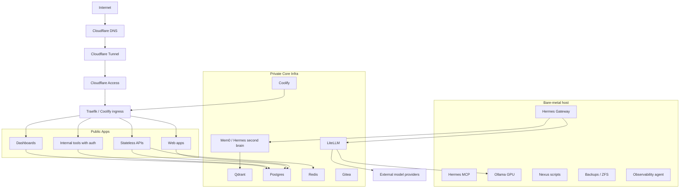

# Homelab Target Architecture - 2026-04

**Purpose:** Document the approved target architecture for the homelab.
**Location:** `/srv/monorepo/docs/ARCHITECTURE/HOMELAB-TARGET-ARCHITECTURE-2026-04.md`
**Audience:** Platform engineering, SRE agents, deployment agents, and reviewers.
**Status:** Approved target architecture as of 2026-04-26.

---

## Overview

The homelab is split into five operational layers:

1. Edge: Cloudflare DNS, Cloudflare Tunnel, and Cloudflare Access.
2. Ingress: Traefik/Coolify ingress.
3. Public Apps: web apps, dashboards, stateless APIs, and internal tools with auth.
4. Bare Metal: Hermes Gateway, Ollama GPU, Nexus scripts, backups/ZFS, and observability agent.
5. Core Infra: LiteLLM, Qdrant, Postgres, Redis, Gitea, and Coolify.

The primary rule is simple: stateful and critical services stay private in Core Infra; only stateless apps cross the public ingress boundary; internal tools require Cloudflare Access or strong application auth.

---

## Target Rules

| Rule | Meaning |
|------|---------|
| Stateful and critical stays private | Databases, vector stores, Git, Coolify internals, and model gateways are not public app workloads. |
| Stateless apps may cross ingress | Public routing is for web apps, dashboards, APIs, and tools that can be safely authenticated and redeployed. |
| Internal tools require protection | Use Cloudflare Access or strong application auth before exposure. |
| Hermes stays bare-metal | Hermes is not a Coolify workload. It runs via host/systemd control. |
| Ollama stays bare-metal | GPU model runtime remains on the host to use the RTX 4090 directly. |
| LiteLLM is the model gateway | Hermes and apps should use LiteLLM instead of calling providers directly unless explicitly documented. |
| Coolify publishes apps | Coolify is a deployment/publishing tool, not the homelab control plane. |
| Monorepo is control plane | The monorepo contains governance, docs, specs, and source boundaries, not every possible app. |

---

## Mermaid Diagram



---

## ASCII Diagram

```
Internet
  |
  v
Cloudflare DNS
  |
  v
Cloudflare Tunnel + Cloudflare Access
  |
  v
Traefik/Coolify ingress
  |
  +--> Public web apps
  +--> Dashboards
  +--> Stateless APIs
  +--> Internal tools with Cloudflare Access or app auth

Bare-metal host
  +--> Hermes Gateway
  |      +--> LiteLLM
  |      |      +--> Ollama GPU
  |      |      +--> External model providers
  |      +--> Mem0 / Hermes second brain
  |             +--> Qdrant
  |
  +--> Ollama GPU
  +--> Nexus scripts
  +--> Backups / ZFS
  +--> Observability agent

Private Core Infra
  +--> LiteLLM
  +--> Qdrant
  +--> Postgres
  +--> Redis
  +--> Gitea
  +--> Coolify
```

---

## Edge

Edge is Cloudflare DNS, Tunnel, and Access.

| Component | Responsibility | Target Exposure |
|-----------|----------------|-----------------|
| Cloudflare DNS | Public DNS records and names | PUBLIC names, policy-controlled |
| Cloudflare Tunnel | Private connector from Cloudflare to the host | No direct inbound port requirement |
| Cloudflare Access | Identity and access gate for internal tools | Required for internal admin/tool routes |

Edge does not own application state. It owns names, routing entry, and identity gates.

---

## Ingress

Ingress is Traefik/Coolify.

| Component | Responsibility | Target Exposure |
|-----------|----------------|-----------------|
| Traefik/Coolify ingress | Route HTTP(S) traffic from Cloudflare to app workloads | PUBLIC or INTERNAL depending on route |
| Coolify app publication | Publish containerized apps and tools | Not a governance layer |

Ingress should route app traffic only. It should not expose Qdrant, Postgres, Redis, Ollama, Hermes, or raw admin interfaces unless a specific exception is documented and protected.

---

## Public Apps

Public Apps are containerized workloads behind ingress.

| App Type | Public Allowed? | Required Protection |
|----------|-----------------|---------------------|
| Web apps | Yes | App auth when user data exists |
| Dashboards | Conditional | Cloudflare Access or app auth |
| Stateless APIs | Yes | Auth, rate limiting, and no direct state ownership |
| Internal tools | Conditional | Cloudflare Access or strong app auth |

Apps may use Postgres or Redis when applicable, but the database/cache remains private Core Infra. Apps must not publish database ports or embed secrets in route configuration.

---

## Bare Metal

Bare-metal services are host-level services that must not be converted into Coolify workloads without a new decision.

| Service | Reason |
|---------|--------|
| Hermes Gateway | Agent orchestration and local host integration. |
| Hermes MCP | Local MCP bridge for agents and tools. |
| Ollama GPU | Requires direct GPU/VRAM management on the RTX 4090. |
| Nexus scripts | Control-plane orchestration from the monorepo. |
| Backups/ZFS | Host-level data protection and rollback foundation. |
| Observability agent | Host telemetry and local health collection. |

---

## Core Infra

Core Infra is private by default.

| Service | Role | Exposure |
|---------|------|----------|
| LiteLLM | Single model gateway for apps and Hermes | INTERNAL, Access-protected if routed |
| Qdrant | Vector DB for RAG/Mem0 | PRIVATE |
| Postgres | Relational state | PRIVATE |
| Redis | Cache/pubsub/session support | PRIVATE |
| Gitea | Git service and internal development state | INTERNAL |
| Coolify | App publication/admin surface | INTERNAL |

Core Infra is where backups, restore tests, access reviews, and secret governance matter most.

---

## Approved Flows

### Internet to Apps

```
Internet -> Cloudflare DNS -> Cloudflare Tunnel/Access -> Traefik/Coolify -> Apps
```

This path is for web apps, dashboards, stateless APIs, and internal tools with auth. It is not for raw databases, model runtimes, or agent control ports.

### Hermes to Models

```
Hermes -> LiteLLM -> Ollama/providers
```

Hermes uses LiteLLM as the model gateway. Ollama is private, bare-metal, and GPU-backed. External providers are reached through LiteLLM unless a documented exception exists.

### Hermes to Memory

```
Hermes -> Qdrant/Mem0
```

Hermes memory flows through Mem0/Hermes second brain and Qdrant. Qdrant is private Core Infra and must not be exposed as a public database route in the target state.

### Apps to State

```
Apps -> Postgres/Redis when applicable
```

Apps may consume private state services over internal networks. Postgres and Redis are never public app endpoints.

---

## Exposure Classes

| Class | Definition |
|-------|------------|
| PUBLIC | Routable from the public Internet through Cloudflare and ingress. |
| INTERNAL | Routable through Cloudflare Access, VPN, LAN, or authenticated admin surfaces. |
| PRIVATE | Not routable from public Internet; only local host/container networks. |
| BARE_METAL | Runs on the host/systemd/filesystem outside Coolify. |
| COOLIFY | Published or managed through Coolify. |
| CORE_INFRA | Stateful or critical infrastructure requiring stricter backup/access rules. |

---

## TODO / UNKNOWN

| Item | Required Follow-up |
|------|--------------------|
| Core Postgres canonical port | Verify active target instance and document exact port/domain. |
| Coolify active admin binding | Reconcile existing references to 8000 and 8080. |
| Qdrant public route | Target says PRIVATE; verify and remove or Access-protect any public route. |
| Dashboard route policy | Classify each dashboard as PUBLIC, INTERNAL, or PRIVATE. |
| Cloudflare Access inventory | Reconcile desired policy with live Cloudflare config before changing routes. |

---

## Related Documents

- [Hardware Hierarchy](../../HARDWARE_HIERARCHY.md)
- [Deployment Boundaries](../REFERENCE/DEPLOYMENT-BOUNDARIES.md)
- [Security Checklist](../REFERENCE/HOMELAB-SECURITY-CHECKLIST.md)
- [Ports Registry](../../ops/ai-governance/PORTS.md)
